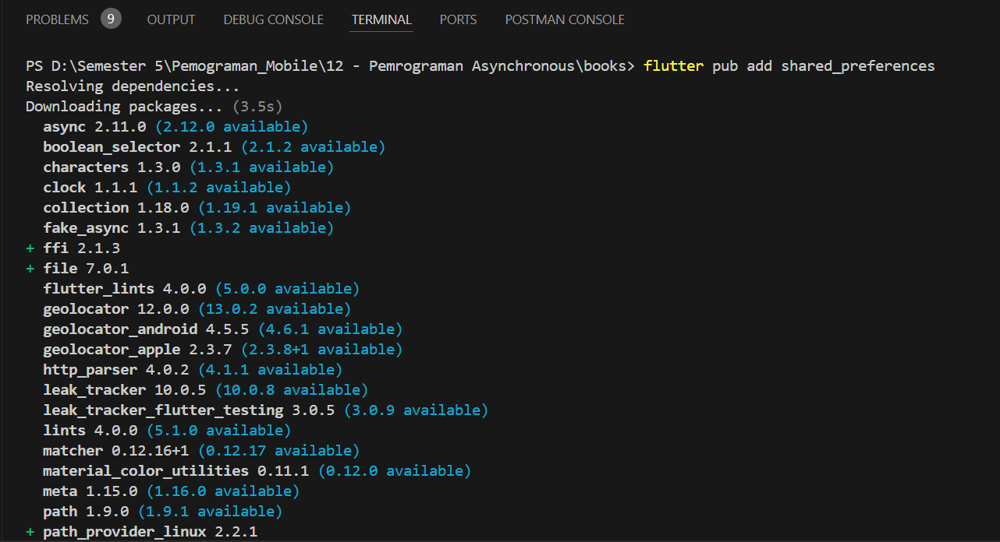
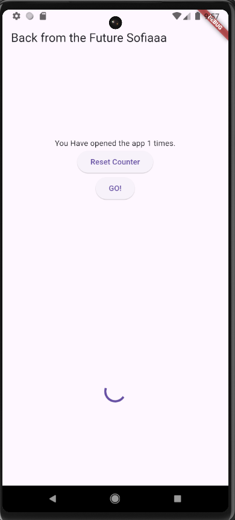

# Jobsheet 14 - Presistensi Data        

## Praktikum 3: Saving data simply with SharedPreferences       

### Gunakan project pada pertemuan 11 bernama books. Pertama, tambahkan ketergantungan pada shared_preferences. Dari Terminal Anda, ketikkan perintah berikut       
        

### Untuk memperbarui dependensi dalam proyek Anda, jalankan perintah flutter pub get dari jendela Terminal.        

### Di bagian atas file main.dart, impor shared_preferences:        
``` dart        
import 'package:shared_preferences/shared_preferences.dart';        
```         

### Di bagian atas kelas _MyHomePageState, buat variabel status integer baru bernama appCounter:        
``` dart        
int appCounter = 0;     
```     

### Dalam kelas _MyHomePageState, buat metode asinkron baru yang disebut readAndWritePreferences():     
``` dart        
Future readAndWritePreference() async {
  
}       
```     

### Di dalam metode readAndWritePreference, buatlah sebuah instance dari SharedPreferences:  
``` dart        
Future readAndWritePreference() async {
    SharedPreferences prefs = await SharedPreferences.getInstance();

  }
```     

### Setelah membuat instance preferensi, kita membuat kode yang mencoba baca nilai kunci appCounter. Jika nilainya nol, setel ke 0; lalu naikkan nilainya:      
``` dart        
appCounter = prefs.getInt('appCounter') ?? 0;
appCounter++;
```     

### Setelah itu, atur nilai kunci appCounter di preferensi ke nilai baru:       
``` dart        
await prefs.setInt('appCounter', appCounter);       
```         

### Memperbarui nilai status appCounter:        
``` dart        
setState(() {
    appCounter = appCounter;  
});
```     

### Pada metode initState di kelas _MyHomePageState, panggil metode readAndWritePreference() dengan kode yang dicetak tebal:        
``` dart        
@override
  void initState(){
    super.initState();
    readAndWritePreference();
  }     
```     

### Dalam metode build, tambahkan kode berikut ini di dalam widget Container:       
       

### Tambahkan metode baru ke kelas _MyHomePageState yang disebut deletePreference(), yang akan menghapus nilai yang disimpan:       
``` dart        
Future deletePreference() async{
    SharedPreferences prefs = await SharedPreferences.getInstance();
    await prefs.clear();
    setState(() {
      appCounter = 0;
    });
  }
```     

### Dari properti onPressed dari widget ElevatedButton di metode build(), memanggil metode deletePreference(), dengan kode di cetak tebal:      
``` dart        
onPressed: () {
              deletePreference();
            },
            child: const Text('Reset counter'),
          ),       
```         

### Jalankan aplikasi lagi. Sekarang, saat Anda menekan tombol Reset penghitung, nilai appCounter akan dihapus              
       


