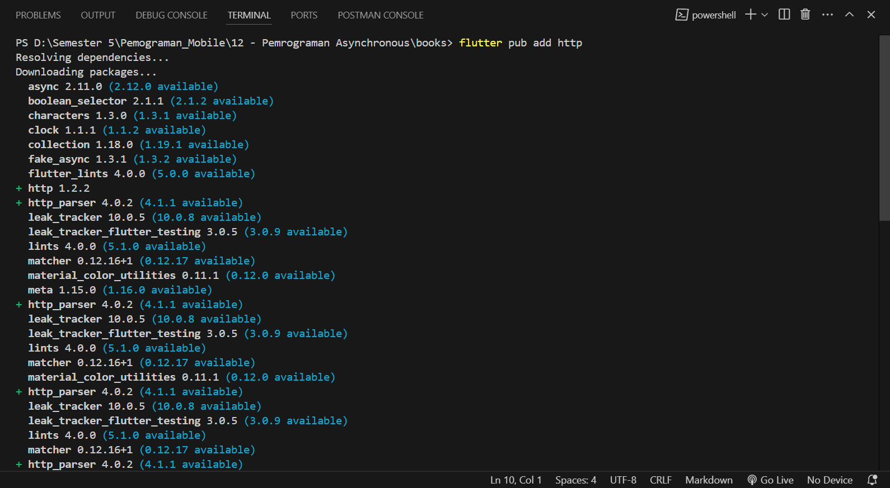
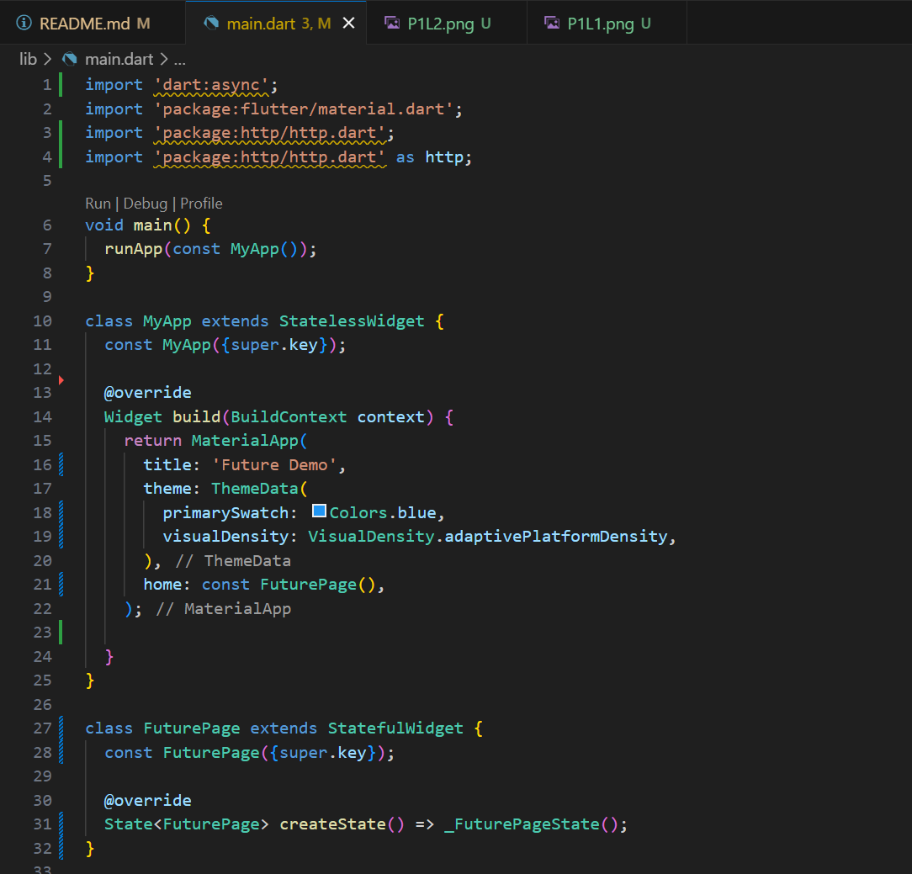
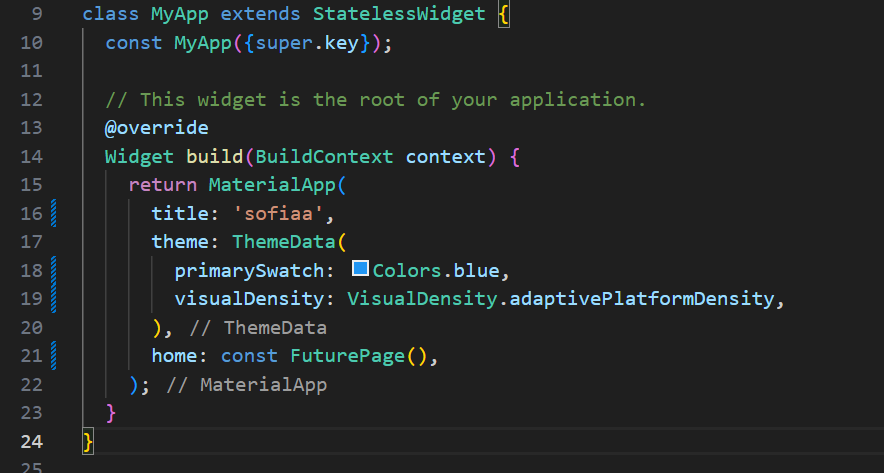
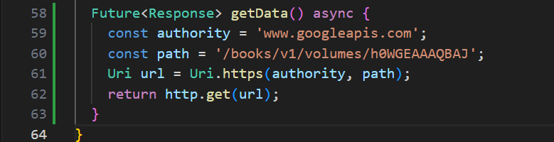
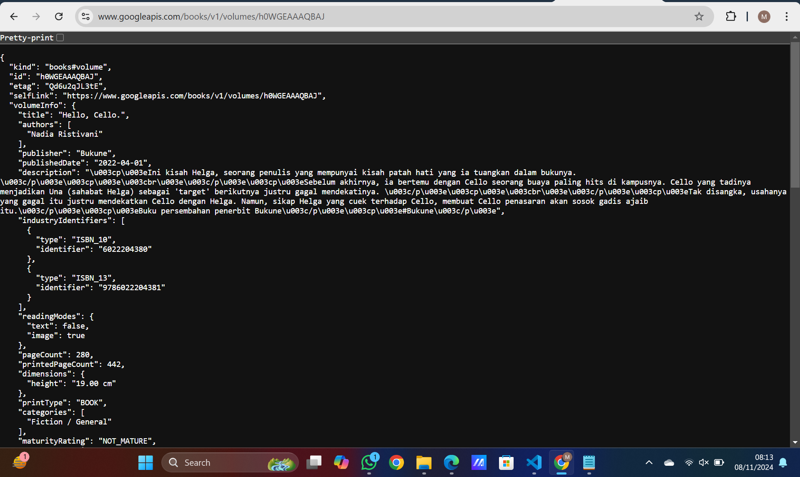

# Praktikum 12 - Pemrograman Asynchronous
Nama    : Masyithah Sophia Damayanti 
Kelas   : TI - 3C       
No      : 15        
NIM     : 2241720011        

## Praktikum 1: Mengunduh Data dari Web Service(API)        

### Langkah 1: Buat Project Baru        
        

### Langkah 2: Cek file pubspec.yaml        
        

### Langkah 3: Buka file main.dart      

Soal 1 dan Hasil:      

``` dart 
import 'dart:async';
import 'package:flutter/material.dart';
import 'package:http/http.dart';
import 'package:http/http.dart' as http;

void main() {
  runApp(const MyApp());
}

class MyApp extends StatelessWidget {
  const MyApp({super.key});

  @override
  Widget build(BuildContext context) {
    return MaterialApp(
      title: 'Future Demo',
      theme: ThemeData(
        primarySwatch: Colors.blue,
        visualDensity: VisualDensity.adaptivePlatformDensity,
      ),
      home: const FuturePage(),
    );

  }
}

class FuturePage extends StatefulWidget {
  const FuturePage({super.key});

  @override
  State<FuturePage> createState() => _FuturePageState();
} 

class _FuturePageState extends State<FuturePage> {
  String result =  '';
  @override
  Widget build(BuildContext context) {
    return Scaffold(
      appBar: AppBar(
        title: const Text('Back from the Future'),
      ),
      body: Center(
        child: Column(children: [
        const Spacer(),
          ElevatedButton(
            child: const Text('GO!'),
            onPressed: () {},
          ),
          const Spacer(),
          Text(result),
          const Spacer(),
          const CircularProgressIndicator(),
          const Spacer(),
        ]),
      ),
    );
  }
}
```   
        

### Langkah 4: Tambah method getData()                   
        
``` dart        
Future<Response> getData() async {
    const authority = 'www.googleapis.com';
    const path = '/books/v1/volumes/h0WGEAAAQBAJ';
    Uri url = Uri.https(authority, path);
    return http.get(url);
  }
```         
Soal 2 dan Hasil:       
 

### Langkah 5: Tambah kode di ElevatedButton        
Soal 3 dan Hasil:                  
         
Penjelasan:         
1. substring(0, 450) untuk mengambil 450 karakter pertama dari hasil data value.body, agar hanya sebagian data yang ditampilkan.
2. catchError untuk menangani kesalahan yang terjadi saat memanggil getData(), dan mengatur result menjadi 'An error occurred' agar aplikasi tetap berjalan tanpa crash.
``` dart
class _FuturePageState extends State<FuturePage> {
  String result = '';

  @override
  Widget build(BuildContext context) {
    return Scaffold(
      appBar: AppBar(
        title: const Text('Back from the Future'),
      ),
      body: Center(
        child: Column(
          children: [
            const Spacer(),
            ElevatedButton(
              child: Text('GO!'),
              onPressed: (){
                setState(() {
                  
                });
                getData().then((value){
                  result = value.body.toString().substring(0,450);
                  setState(() {
                    
                  });
                }).catchError((_){
                  result = 'An error occured';
                  setState(() {
                    
                  });
                });
              },
            ),
            const Spacer(),
            Text(result),
            const Spacer(),
            const CircularProgressIndicator(),
            const Spacer(),
          ],
        ),
      ),
    );
  }        
```     

## Praktikum 2: Menggunakan await/async untuk menghindari callbacks         

### Langkah 1: Buka file main.dart          


