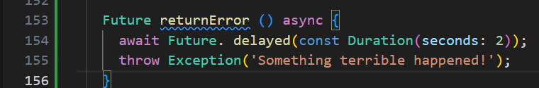

# Praktikum 12 - Pemrograman Asynchronous
Nama    : Masyithah Sophia Damayanti 
Kelas   : TI - 3C       
No      : 15        
NIM     : 2241720011        

## Praktikum 1: Mengunduh Data dari Web Service(API)        

### Langkah 1: Buat Project Baru        
        

### Langkah 2: Cek file pubspec.yaml        
        

### Langkah 3: Buka file main.dart      

Soal 1 dan Hasil:      

``` dart 
import 'dart:async';
import 'package:flutter/material.dart';
import 'package:http/http.dart';
import 'package:http/http.dart' as http;

void main() {
  runApp(const MyApp());
}

class MyApp extends StatelessWidget {
  const MyApp({super.key});

  @override
  Widget build(BuildContext context) {
    return MaterialApp(
      title: 'Future Demo',
      theme: ThemeData(
        primarySwatch: Colors.blue,
        visualDensity: VisualDensity.adaptivePlatformDensity,
      ),
      home: const FuturePage(),
    );

  }
}

class FuturePage extends StatefulWidget {
  const FuturePage({super.key});

  @override
  State<FuturePage> createState() => _FuturePageState();
} 

class _FuturePageState extends State<FuturePage> {
  String result =  '';
  @override
  Widget build(BuildContext context) {
    return Scaffold(
      appBar: AppBar(
        title: const Text('Back from the Future'),
      ),
      body: Center(
        child: Column(children: [
        const Spacer(),
          ElevatedButton(
            child: const Text('GO!'),
            onPressed: () {},
          ),
          const Spacer(),
          Text(result),
          const Spacer(),
          const CircularProgressIndicator(),
          const Spacer(),
        ]),
      ),
    );
  }
}
```   
        

### Langkah 4: Tambah method getData()                   
        
``` dart        
Future<Response> getData() async {
    const authority = 'www.googleapis.com';
    const path = '/books/v1/volumes/h0WGEAAAQBAJ';
    Uri url = Uri.https(authority, path);
    return http.get(url);
  }
```         
Soal 2 dan Hasil:       
 

### Langkah 5: Tambah kode di ElevatedButton        
Soal 3 dan Hasil:                  
         
Penjelasan:         
1. substring(0, 450) untuk mengambil 450 karakter pertama dari hasil data value.body, agar hanya sebagian data yang ditampilkan.
2. catchError untuk menangani kesalahan yang terjadi saat memanggil getData(), dan mengatur result menjadi 'An error occurred' agar aplikasi tetap berjalan tanpa crash.
``` dart
class _FuturePageState extends State<FuturePage> {
  String result = '';

  @override
  Widget build(BuildContext context) {
    return Scaffold(
      appBar: AppBar(
        title: const Text('Back from the Future'),
      ),
      body: Center(
        child: Column(
          children: [
            const Spacer(),
            ElevatedButton(
              child: Text('GO!'),
              onPressed: (){
                setState(() {
                  
                });
                getData().then((value){
                  result = value.body.toString().substring(0,450);
                  setState(() {
                    
                  });
                }).catchError((_){
                  result = 'An error occured';
                  setState(() {
                    
                  });
                });
              },
            ),
            const Spacer(),
            Text(result),
            const Spacer(),
            const CircularProgressIndicator(),
            const Spacer(),
          ],
        ),
      ),
    );
  }        
```     

## Praktikum 2: Menggunakan await/async untuk menghindari callbacks         

### Langkah 1: Buka file main.dart          
        

### Langkah 2: Tambah method count()        
        

### Langkah 3: Panggil count()      
        

### Langkah 4: Run 
Soal 4 dan Hasil:           
         
Penjelasan:    
* Kode langkah 1: Terdapat 3 fungsi asynchronous (returnOneAsync, returnTwoAsync, returnThreeAsync) masing-masing menunggu 3 detik sebelum mengembalikan angka 1, 2, dan 3.
* Kode langkah 2: Untuk fungsi count menjalankan ketiga fungsi di atas secara berurutan, menambahkan hasilnya ke total. Setelah semua selesai, hasilnya (total = 6) ditampilkan pada UI melalui setState().     

## Praktikum 3: Menggunakan Completer di Future     

### Langkah 1: Buka main.dart       
        

### Langkah 2: Tambahkan variabel dan method        
        

### Langkah 3: Ganti isi kode onPressed() 
        

### Langkah 4: 
Soal 5 dan Hasil:     
         
Penjelasan:         
Kode Program menggunakan Completer untuk mengontrol kapan Future selesai:

getNumber(): Membuat Future yang belum selesai dan menjalankan calculate() untuk mengisi hasilnya.
calculate(): Menunggu 5 detik, lalu melengkapi Future dengan nilai 42.
Setelah 5 detik, getNumber() akan menghasilkan nilai 42.        

### Langkah 5: Ganti method calculate()     
        

### Langkah 6: Pindah ke onPressed()        
        
Soal 6 dan Hasil:           
     
Penjelasan:         
* Langkah 2: Kode langkah 2 tidak menangani kesalahan, hanya menunggu 5 detik dan mengembalikan 42.     
* Langkah 5: berfungsi untuk memperbarui calculate() dengan cara menangani error pakai try-catch. jika proses berhasil, completer.complete(42) akan dipanggil setelah 5 detik. Tapi kalau ada masalah, completer.completeError({}) yang dipakai untuk menandai ada kesalahan.       
* Langkah 6: fungsi 'getNumber().then' untuk memproses hasil jika berhasil dan '(result = value.toString())', atau '.catchError(...)' untuk menampilkan pesan 'An error occurred' jika terjadi kesalahan.       
``` dart        
import 'dart:async';

import 'package:flutter/material.dart';
import 'package:http/http.dart';
import 'package:http/http.dart' as http;
import 'package:async/async.dart';

void main() {
  runApp(const MyApp());
}

class MyApp extends StatelessWidget {
  const MyApp({super.key});

  // This widget is the root of your application.
  @override
  Widget build(BuildContext context) {
    return MaterialApp(
      title: 'sofiaa',
      theme: ThemeData(
        primarySwatch: Colors.blue,
        visualDensity: VisualDensity.adaptivePlatformDensity,
      ),
      home: const FuturePage(),
    );
  }
}

class FuturePage extends StatefulWidget {
  const FuturePage({super.key});

  @override
  State<FuturePage> createState() => _FuturePageState();
}

class _FuturePageState extends State<FuturePage> {
  String result = '';
  late Completer completer;

Future getNumber() {
  completer = Completer<int>();
  calculate();
  return completer.future;
}

Future calculate() async {
  try {
    await Future.delayed(const Duration(seconds : 5));
    completer.complete(42);
  }
  catch(_) {
    completer.completeError({});
  }
}
  @override
  Widget build(BuildContext context) {
    return Scaffold(
      appBar: AppBar(
        title: const Text('Back from the Future Sofiaaa'),
      ),
      body: Center(
        child: Column(
          children: [
            const Spacer(),
            ElevatedButton(
              child: Text('GO!'),
              onPressed: (){
                getNumber().then( (value) {
                setState(() {
                  result = value. toString();
                });
              }).catchError((_){
                  result = 'An error occured';
                });
                //count();
                // setState(() {
                  
                // });
                // getData().then((value){
                //   result = value.body.toString().substring(0,450);
                //   setState(() {
                    
                //   });
                // }).catchError((_){
                //   result = 'An error occured';
                //   setState(() {
                    
                //   });
                // });
              },
            ),
            const Spacer(),
            Text(result),
            const Spacer(),
            const CircularProgressIndicator(),
            const Spacer(),
          ],
        ),
      ),
    );
  }

  Future<Response> getData() async {
    const authority = 'www.googleapis.com';
    const path = '/books/v1/volumes/h0WGEAAAQBAJ';
    Uri url = Uri.https(authority, path);
    return http.get(url);
  } 

  Future<int> returnOneAsync() async {
    await Future.delayed(const Duration(seconds: 3));
    return 1;
  }

  Future<int> returnTwoAsync() async {
    await Future.delayed(const Duration(seconds: 3));
    return 2;
  }

  Future<int> returnThreeAsync() async {
    await Future.delayed(const Duration(seconds: 3));
    return 3;
  }

  Future count() async {
    int total = 0;
    total = await returnOneAsync();
    total += await returnTwoAsync();
    total += await returnThreeAsync();
    setState(() {
      result = total.toString();
    });
  }
  
}
```     
## Praktikum 4: Memanggil Future secara paralel     

### Langkah 1: Buka file main.dart      
        

### Langkah 2: Edit onPressed()     
        

### Langkah 3: Run      
Soal 7 dan Hasil:            
         

### Langkah 4: Ganti variabel futureGroup       
        
Soal 8 dan hasil:       
     
Penjelasan:     
* Langkah 1: 'FutureGroup' untuk menambahkan beberapa Future dan menunggu sampai semuanya selesai, lalu mengolah hasilnya.            
* Langkah 4: 'Future.wait' untuk langsung menunggu beberapa Future sekaligus dan dapatkan hasilnya dalam satu daftar, lebih simpel dan cepat.       

## Praktikum 5: Menangani Respon Error pada Async Code      

### Langkah 1: Buka file main.dart          
        

### Langkah 2: ElevatedButton    
   

### Langkah 3: Run    
        

### Langkah 4: Tambah method handleError()    
      

Soal 10 dan Hasil:      
     
Penjelasan:     
Perbedaan Kode Langkah 1 dan Langkah 4

Langkah 1: Menggunakan then(), catchError, dan whenComplete.        
* Memanfaatkan callback then() untuk menangani success dan catchError untuk menangani error.
* whenComplete akan dijalankan setelah proses selesai, baik itu sukses maupun gagal.
* Kode ini lebih pendek namun mungkin sulit dibaca ketika ada banyak nested callbacks.    
Langkah 4: Menggunakan try-catch-finally dengan async/await.    

* Lebih sederhana dan rapi karena menggunakan try-catch untuk menangani error.
* finally berfungsi mirip dengan whenComplete dalam then(), tetapi lebih terstruktur dalam pola async/await.
* Cocok untuk kode asynchronous yang lebih kompleks, karena async/await lebih mudah dibaca dan dipahami.    

##  Praktikum 6: Menggunakan Future dengan StatefulWidget


