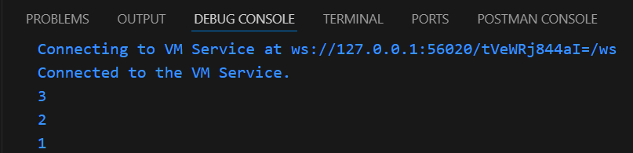
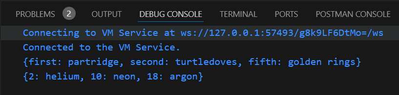
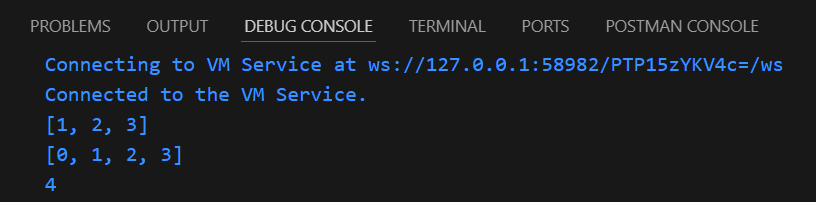

### Nama    : Masyithah Sophia Damayanti
### Kelas   : TI - 3C
### NIM     : 2241720011

# Praktikum 1: Eksperimen Tipe Data List
## Langkah 1:
Ketik atau salin kode program berikut ke dalam void main().
```dart
var list = [1, 2, 3];
assert(list.length == 3);
assert(list[1] == 2);
print(list.length);
print(list[1]);

list[1] = 1;
assert(list[1] == 1);
print(list[1]);
```
## Langkah 2:
Silakan coba eksekusi (Run) kode pada langkah 1 tersebut. Apa yang terjadi? Jelaskan!      
Jawab:      
      
Kode Dart ini membuat list list dengan elemen [1, 2, 3] dan menggunakan assert untuk memastikan panjang list adalah 3 dan elemen kedua adalah 2. Karena kondisi tersebut benar, program mencetak panjang list 3 dan elemen kedua 2. Kemudian, nilai elemen kedua diubah dari 2 menjadi 1, dan assert digunakan lagi untuk memverifikasi perubahan ini. Setelah diverifikasi, program mencetak elemen kedua yang baru, 1. Output akhirnya adalah 3, 2, dan 1. Jika ada assert yang gagal, program akan berhenti, tetapi di sini semuanya berjalan lancar.

## Langkah 3:
Ubah kode pada langkah 1 menjadi variabel final yang mempunyai index = 5 dengan default value = null. Isilah nama dan NIM Anda pada elemen index ke-1 dan ke-2. Lalu print dan capture hasilnya.Apa yang terjadi ? Jika terjadi error, silakan perbaiki.        
Jawab:      
        
Kode Dart mengubah variabel list menjadi final, sehingga referensinya tidak dapat diubah, tetapi elemennya bisa. List ini dibuat dengan panjang 5 menggunakan List.filled(5, null), yang menginisialisasi semua elemen dengan null. Kemudian, elemen pada indeks 1 dan 2 diisi dengan nama dan NIM. Saat dijalankan, list menampilkan nama dan NIM pada indeks yang diisi, sementara elemen lain tetap null. Kode ini tidak menghasilkan error jika ditulis dengan benar.

# Praktikum 2: Eksperimen Tipe Data Set  
## Langkah 1:
Ketik atau salin kode program berikut ke dalam fungsi main().
```dart
var halogens = {'fluorine', 'chlorine', 'bromine', 'iodine', 'astatine'};
print(halogens);
```
## Langkah 2:
Silakan coba eksekusi (Run) kode pada langkah 1 tersebut. Apa yang terjadi? Jelaskan! Lalu perbaiki jika terjadi error.     
Jawab:      

Kode Dart tersebut membuat sebuah Set bernama halogens yang berisi nama-nama unsur halogen: 'fluorine', 'chlorine', 'bromine', 'iodine', dan 'astatine'. Karena Set di Dart tidak memiliki urutan elemen yang pasti dan tidak mengizinkan elemen duplikat, saat kode dijalankan, isi Set tersebut akan dicetak, tetapi urutannya bisa berbeda setiap kali dijalankan. Kode ini tidak menghasilkan error dan berfungsi dengan benar.

## Langkah 3:
Tambahkan kode program berikut, lalu coba eksekusi (Run) kode Anda.
```dart
var names1 = <String>{};
Set<String> names2 = {}; // This works, too.
var names3 = {}; // Creates a map, not a set.

print(names1);
print(names2);
print(names3);
```
Apa yang terjadi ?Jika terjadi error, silakan perbaiki namun tetap menggunakan ketiga variabel tersebut. Tambahkan elemen nama dan NIM Anda pada kedua variabel Set tersebut dengan dua fungsi berbeda yaitu .add() dan .addAll().     
Jawab:  

Hasil setelah ditambahkan kode:
        
Kode Dart ini membuat dua Set kosong (names1 dan names2) dan menambahkan nama serta NIM menggunakan dua metode berbeda: .add() dan .addAll(). Pada names1, elemen nama dan NIM ditambahkan satu per satu dengan menggunakan .add(). Sedangkan pada names2, elemen nama dan NIM ditambahkan sekaligus dengan menggunakan .addAll(). Setelah itu, isi dari kedua Set dicetak, menunjukkan bahwa kedua Set tersebut sekarang berisi nama dan NIM yang telah ditambahkan.  

# Praktikum 3: Eksperimen Tipe Data Maps
## Langkah 1:
Ketik atau salin kode program berikut ke dalam fungsi main().
```dart
var gifts = {
  // Key:    Value
  'first': 'partridge',
  'second': 'turtledoves',
  'fifth': 1
};

var nobleGases = {
  2: 'helium',
  10: 'neon',
  18: 2,
};

print(gifts);
print(nobleGases);
```
## Langkah 2:
Silakan coba eksekusi (Run) kode pada langkah 1 tersebut. Apa yang terjadi? Jelaskan! Lalu perbaiki jika terjadi error.
Jawab:      
        
Kode Dart ini membuat dua Map yaitu gifts dan nobleGases. Untuk Map gifts memiliki kunci berupa teks String dan nilai campuran antara teks String dan angka int. nobleGases menggunakan angka/int sebagai kunci dan memiliki nilai campuran berupa teks dan angka. Saat kode dijalankan, kedua Map dicetak ke konsol, menampilkan semua pasangan kunci-nilai yang ada. Tidak ada error yang muncul karena Dart memungkinkan penggunaan tipe data campuran dalam Map.


## Langkah 3:
Tambahkan kode program berikut, lalu coba eksekusi (Run) kode Anda.
```dart
var mhs1 = Map<String, String>();
gifts['first'] = 'partridge';
gifts['second'] = 'turtledoves';
gifts['fifth'] = 'golden rings';

var mhs2 = Map<int, String>();
nobleGases[2] = 'helium';
nobleGases[10] = 'neon';
nobleGases[18] = 'argon';
```
Apa yang terjadi ? Jika terjadi error, silakan perbaiki.
Jawab: 
        
Kode diatas untuk mengubah nilai dalam dua Map, yaitu gifts dan nobleGases, selanjutnya akan dicetak hasilnya. Namun, hasilnya terjadi error karena Map gifts dan nobleGases memiliki nilai dengan tipe data yang berbeda, seperti int dan String. Untuk memperbaikinya, semua nilai dalam Map harus konsisten dengan tipe data yang sama, misalnya semua String. Setelah perbaikan, kode berjalan dengan benar dan menampilkan hasil yang diharapkan tanpa error.
## Soal
Tambahkan elemen nama dan NIM Anda pada tiap variabel di atas (gifts, nobleGases, mhs1, dan mhs2). Dokumentasikan hasilnya dan buat laporannya!   
Jawab:      
      
Set (halogens, names1, names2) berfungsi untuk menyimpan data unik. Pada elemen yang ditambahkan menggunakan add dan addAll, lalu dicetak.
   
Map (gifts, nobleGases, mhs1, mhs2) berfungsi untuk menyimpan pasangan kunci-nilai. Data yang baru ditambahkan dengan indeks kunci dan akan dicetak setelah diperbarui.

# Praktikum 4: Eksperimen Tipe Data List: Spread dan Control-flow Operators
## Langkah 1:
Ketik atau salin kode program berikut ke dalam fungsi main().
```dart
var list = [1, 2, 3];
var list2 = [0, ...list];
print(list1);
print(list2);
print(list2.length);
```
## Langkah 2:
Silakan coba eksekusi (Run) kode pada langkah 1 tersebut. Apa yang terjadi? Jelaskan! Lalu perbaiki jika terjadi error.
Jawab:    
  
Hasilnya eror karena kode diatas membuat  variabek list dengan elemen [1, 2, 3] dan variabel list2 dengan elemen [0, 1, 2, 3] menggunakan operator spread. Untuk mencetak print(list1) menyebabkan error karena varibale list1 tidak ada, sedangkan print(list2)mencetak [0, 1, 2, 3] dan print(list2.length) mencetak 4.   
Kode Program Setelah diperbaiki :     


## Langkah 3:
Tambahkan kode program berikut, lalu coba eksekusi (Run) kode Anda.
```dart
list1 = [1, 2, null];
print(list1);
var list3 = [0, ...?list1];
print(list3.length);
```
Apa yang terjadi ? Jika terjadi error, silakan perbaiki.
Jawab:   
 
hasilnya eror     
Hasil kode program yang sudah diperbaiki:
  
Tambahkan variabel list berisi NIM Anda menggunakan Spread Operators. Dokumentasikan hasilnya dan buat laporannya!    
Jawab:    
 
Kode tersebut menyaring elemen null dari list1, kemudian menggabungkan hasilnya dengan nimList untuk menghasilkan list akhir [0, 1, 2, '2241720011'] yang memiliki panjang 4.

## Langkah 4:
Tambahkan kode program berikut, lalu coba eksekusi (Run) kode Anda.
```dart
var nav = ['Home', 'Furniture', 'Plants', if (promoActive) 'Outlet'];
print(nav);
``` 
Apa yang terjadi ? Jika terjadi error, silakan perbaiki. Tunjukkan hasilnya jika variabel promoActive ketika true dan false.    
Jawab:    

Hasilnya eror.    
Hasil Kode program yang sudah diperbaiki:       


## Langkah 5:
Tambahkan kode program berikut, lalu coba eksekusi (Run) kode Anda.
```dart
var nav2 = ['Home', 'Furniture', 'Plants', if (login case 'Manager') 'Inventory'];
print(nav2);
```
Apa yang terjadi ? Jika terjadi error, silakan perbaiki. Tunjukkan hasilnya jika variabel login mempunyai kondisi lain.   
Jawab:    
 
Hasilnya eror.    
Hasil Kode Program yang sudah diperbaiki: 


## Langkah 6:
Tambahkan kode program berikut, lalu coba eksekusi (Run) kode Anda.
```dart
var listOfInts = [1, 2, 3];
var listOfStrings = ['#0', for (var i in listOfInts) '#$i'];
assert(listOfStrings[1] == '#1');
print(listOfStrings);
```
Apa yang terjadi ? Jika terjadi error, silakan perbaiki. Jelaskan manfaat Collection For dan dokumentasikan hasilnya.   
Jawab:     
     
Manfaat Collection For:
1. Membuat list berdasarkan hasil iterasi dengan cara yang ringkas sehingga menjadi efisien dan dinamis
2. Mengurangi ambigu pada kode dan membuatnya lebih mudah dipahami.
3. Memungkinkan penciptaan list yang menggabungkan elemen statis dan dinamis secara bersamaan.

# Praktikum 5: Eksperimen Tipe Data Records
## Langkah 1:
Ketik atau salin kode program berikut ke dalam fungsi main().
```dart
var record = ('first', a: 2, b: true, 'last');
print(record)
```
Langkah 2:
Silakan coba eksekusi (Run) kode pada langkah 1 tersebut. Apa yang terjadi? Jelaskan! Lalu perbaiki jika terjadi error.
 
Hasil eror karena tidak ada titik koma
 
Kode diatas mendeklarasikan Record dengan elemen 'first', 2 (label a), true (label b), dan 'last', yang dicetak sebagai (first, a: 2, b: true, last).

## Langkah 3:
Tambahkan kode program berikut di luar scope void main(), lalu coba eksekusi (Run) kode Anda.
```dart
(int, int) tukar((int, int) record) {
  var (a, b) = record;
  return (b, a);
}
```
Apa yang terjadi ? Jika terjadi error, silakan perbaiki. Gunakan fungsi tukar() di dalam main() sehingga tampak jelas proses pertukaran value field di dalam Records.   
Jawab:    
   

## Langkah 4:
Tambahkan kode program berikut di dalam scope void main(), lalu coba eksekusi (Run) kode Anda.
```dart
// Record type annotation in a variable declaration:
(String, int) mahasiswa;
print(mahasiswa);   
```
Apa yang terjadi ? Jika terjadi error, silakan perbaiki. Inisialisasi field nama dan NIM Anda pada variabel record mahasiswa di atas. Dokumentasikan hasilnya dan buat laporannya!    
Jawab:    
 
hasilnya eror.    
hasil Kode program setelah diperbaiki:    
   
Record mahasiswa diinisialisasi dengan nama 'Masyithah Sophia Damayanti' dan NIM 2241720011. Ketika dicetak, hasilnya adalah (Masyithah Sophia Damayanti, 2241720011).

## Langkah 5:
Tambahkan kode program berikut di dalam scope void main(), lalu coba eksekusi (Run) kode Anda.
```dart
var mahasiswa2 = ('first', a: 2, b: true, 'last');

print(mahasiswa2.$1); // Prints 'first'
print(mahasiswa2.a); // Prints 2
print(mahasiswa2.b); // Prints true
print(mahasiswa2.$2); // Prints 'last'
```
Apa yang terjadi ? Jika terjadi error, silakan perbaiki. Gantilah salah satu isi record dengan nama dan NIM Anda, lalu dokumentasikan hasilnya dan buat laporannya!   
Jawab:    
     
Hasil Setelah mengganti nama dan nim:   
   

# Tugas Praktikum
1. Silakan selesaikan Praktikum 1 sampai 5, lalu dokumentasikan berupa screenshot hasil pekerjaan Anda beserta penjelasannya!   
2. Jelaskan yang dimaksud Functions dalam bahasa Dart!    
Jawab:    
Fungsi dalam Dart adalah blok kode yang dapat dipanggil untuk melakukan tugas tertentu dan dapat mengembalikan nilai. Fungsi memudahkan pengorganisasian dan penggunaan kembali kode, serta dapat menerima parameter dengan nilai default atau opsional.    

3. Jelaskan jenis-jenis parameter di Functions beserta contoh sintaksnya!     
Jawab:        
-  Parameter Posisi (Positional Parameters):Parameter yang harus diberikan dalam urutan yang ditentukan saat memanggil fungsi.    
Contoh: 
```dart    
void greet(String name, int age) {
  print('Halo, $name. Kamu berusia $age tahun.');
}
greet('Sofi', 20); 
```   
- Parameter Opsional Posisi (Optional Positional Parameters): Parameter ini dideklarasikan dalam tanda kurung siku [] dan tidak perlu diberikan saat memanggil fungsi; jika tidak diberikan, nilainya default null.       
Contoh: 
```dart  
void greet(String name, [int age]) {
  print('Halo, $name. ${age != null ? 'Kamu berusia $age tahun.' : ''}');
}
greet('sofi');          
greet('sofi', 20); 
```
- Parameter Opsional Named (Named Optional Parameters): Parameter ini dideklarasikan dalam tanda kurung kurawal {} dan dapat disebut dengan nama saat memanggil fungsi. Parameter ini juga bisa memiliki nilai default.   
Contoh:       
```dart
void greet(String name, {int age = 0, String greeting = 'Halo'}) {
  print('$greeting, $name. Kamu berusia $age tahun.');
}
greet('sofi');                   
greet('sofi', age: 20);          
greet('sofi', greeting: 'Hi');  
```
4. Jelaskan maksud Functions sebagai first-class objects beserta contoh sintaknya!  
Jawab:    
- Disimpan dalam Variabel:
Fungsi dapat disimpan dalam variabel dan digunakan seperti nilai lainnya.   
Contoh:
```dart
void greet(String name) {
  print('Hello, $name!');
}

var greetFunction = greet; 
greetFunction('sofi');       
```     
- Dikirim sebagai Argumen:
Fungsi dapat diteruskan sebagai argumen ke fungsi lain.
Contoh:
```dart
void executeFunction(String name, void Function(String) action) {
  action(name);
}

void greet(String name) {
  print('Hello, $name!');
}
```   
- Mengembalikan Fungsi:
Fungsi dapat mengembalikan fungsi lain sebagai hasilnya.
Contoh:
```dart
Function makeMultiplier(int multiplier) {
  return (int value) => value * multiplier;
}

var doubleFunction = makeMultiplier(2);
print(doubleFunction(5)); 
```
- Digunakan dalam Closure:
Fungsi dapat menciptakan dan menyimpan lingkungan lokal yang masih dapat diakses.
Contoh:
```dart
Function createCounter() {
  int count = 0;
  return () {
    count++;
    return count;
  };
}

var counter = createCounter(); 
print(counter()); 
print(counter());
```   

5. Apa itu Anonymous Functions? Jelaskan dan berikan contohnya!       
Jawab:      
Fungsi anonim dideklarasikan secara langsung dalam konteks di mana fungsi tersebut diperlukan, tanpa harus memberikan nama untuk fungsi tersebut.
Fungsi ini biasanya digunakan dalam operasi yang membutuhkan fungsi singkat, seperti dalam operasi koleksi atau callback.     
Contoh:     
- Menggunakan Fungsi Anonim dalam Operasi Koleksi:
```dart
void main() {
  var numbers = [1, 2, 3, 4, 5];
  
  var doubled = numbers.map((n) => n * 2);
  print(doubled.toList()); // Output: [2, 4, 6, 8, 10] 
}
```
- Menggunakan Fungsi Anonim sebagai Callback:
```dart
void main() {
 
  void performAction(String action(String)) {
    var result = action('Hello Sofi');
    print(result);
  }
  performAction((message) => message.toUpperCase());  // Output: HELLO SOFI
}
```   
- Menggunakan Fungsi Anonim dalam Pengurutan:
```dart
void main() {
  var names = ['Sofi', 'Lintang', 'Putri'];
  
  names.sort((a, b) => a.length.compareTo(b.length));
  
  print(names);  // Output: [Lintang, Putri, Sofi]
}
```
6. Jelaskan perbedaan Lexical scope dan Lexical closures! Berikan contohnya!    
Jawab:        
- Lexical Scope   
  * Variabel lokal hanya dapat diakses di dalam fungsi atau blok tempat mereka dideklarasikan.
  * Variabel global dapat diakses di mana saja dalam program.
  Contoh program: 
  ```dart    
  void main() {
  int x = 10; // variabel global

  void printX() {
    print(x); // mengakses variabel global x
  }

  printX();  // Output: 10
  }
```
- Lexical Closures
 fungsi yang mengingat dan dapat mengakses variabel dari lingkup (scope) di mana fungsi tersebut dideklarasikan, meskipun fungsi tersebut dipanggil di luar lingkup tersebut. Ini memungkinkan fungsi untuk "menyimpan" dan "mengakses" variabel-variabel tersebut setelah lingkup asalnya telah berakhir.
Contoh:   
```dart
  void main() {
    Function makeCounter() {
      int count = 0; // variabel dalam lexical scope

      return () {
        count++; // akses dan modifikasi variabel dari lexical scope
        return count;
      };
    }

    var counter = makeCounter();
    print(counter()); // Output: 1
    print(counter()); // Output: 2
  }
```
7. Jelaskan dengan contoh cara membuat return multiple value di Functions!    
Jawab: 
- Menggunakan Tuple (Dengan Paket Eksternal)
Dart tidak memiliki tipe tuple bawaan, tetapi Anda bisa menggunakan paket eksternal seperti tuple untuk mengembalikan beberapa nilai. Berikut adalah contohnya:

- Contoh dengan Paket tuple:
```dart
import 'package:tuple/tuple.dart';

Tuple2<int, String> getPerson() {
  return Tuple2(20, 'sofi'); // Mengembalikan dua nilai
}

void main() {
  var person = getPerson();
  print('Age: ${person.item1}, Name: ${person.item2}');
}
```       
Penjelasan: Tuple2 dari paket tuple digunakan untuk mengembalikan dua nilai: usia dan nama.
Menggunakan Map
Anda dapat mengembalikan beberapa nilai menggunakan sebuah Map, yang memungkinkan Anda mengidentifikasi nilai-nilai tersebut dengan kunci.

- Contoh dengan Map:
Map<String, dynamic> getPerson() {
  return {
    'age': 20,
    'name': 'sofi'
  };
}

void main() {
  var person = getPerson();
  print('Age: ${person['age']}, Name: ${person['name']}');
}
Penjelasan: Fungsi getPerson mengembalikan sebuah Map dengan kunci 'age' dan 'name'.

- Menggunakan Class atau Record   
```dart
class Person {
  final int age;
  final String name;

  Person(this.age, this.name);
}

Person getPerson() {
  return Person(20, 'sofi');
}

void main() {
  var person = getPerson();
  print('Age: ${person.age}, Name: ${person.name}');
}
```
Penjelasan: Kelas Person digunakan untuk mengelompokkan nilai age dan name. Fungsi getPerson mengembalikan objek dari kelas ini.

8. Kumpulkan berupa link commit repo GitHub pada tautan yang telah disediakan di grup Telegram!   


