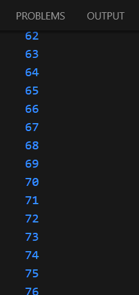

### Nama    : Masyithah Sophia Damayanti
### Kelas   : TI-3C / 15
### NIM     : 2241720011

# Praktikum 1: Menerapkan Control Flows ("if/else")
## Langkah 1
Ketik atau salin kode program berikut ke dalam fungsi main()..
```dart
String test = "test2";
if (test == "test1") {
   print("Test1");
} else If (test == "test2") {
   print("Test2");
} Else {
   print("Something else");
}
if (test == "test2") print("Test2 again");
```

## Langkah 2:
Silakan coba eksekusi (Run) kode pada langkah 1 tersebut. Apa yang terjadi Jelaskan!        
Jawab :     
      
Pertama, variabel test diinisialisasi dengan nilai "test2". Program kemudian memeriksa beberapa kondisi menggunakan blok if-else if-else. Ketika memeriksa kondisi pertama (if (test == "test1")), program tidak menjalankan perintah apapun karena kondisi tersebut tidak terpenuhi. Selanjutnya, program memeriksa kondisi kedua (else if (test == "test2")), yang ternyata terpenuhi, sehingga program mencetak "Test2" ke konsol. Blok else tidak dijalankan karena kondisi sebelumnya sudah terpenuhi.

Setelah itu, program memeriksa kembali nilai test dengan pernyataan if kedua (if (test == "test2")). Karena kondisi ini juga terpenuhi, program mencetak "Test2 again" ke konsol.

Hasil akhir dari program ini adalah dua keluaran yang tercetak ke konsol: "Test2" dan "Test2 again".

## Langkah 3:
Tambahkan kode program berikut, lalu coba eksekusi (Run) kode Anda.
```dart
String test = "true";
if (test) {
   print("Kebenaran");
}
```
Apa yang terjadi ? Jika terjadi error, silakan perbaiki namun tetap menggunakan if/else.    
Jawab :     
    
Kode tersebut akan error dikarenakan tipe data dari kode diatas masih menggunakan string, dan seharusnya menggunakan boolean. Maka diubah menjadi:  
```dart
 bool isTrue = true;
  if (isTrue) {
    print("Kebenaran");
  }
```
Hasil :     


# Praktikum 2: Menerapkan Perulangan "while" dan "do-while"

## Langkah 1:
Ketik atau salin kode program berikut ke dalam fungsi main().
```dart
while (counter < 33) {
  print(counter);
  counter++;
}
```     

## Langkah 2:
Silakan coba eksekusi (Run) kode pada langkah 1 tersebut. Apa yang terjadi? Jelaskan! Lalu perbaiki jika terjadi error.     
Jawab :    
        
Karena variabelnya belum dideklarasikan dan diinisialisasikan. Maka kode ditambahkan seperti ini :
```dart
void main() {
  int counter = 0;
  while (counter < 33) {
    print(counter);
    counter++;
  }
}
```
Hasilnya :      

Akan menampilkan angka yang dimulai dari 0 sampai 32. Karena di kode tersebut Perulangan dimulai dengan counter = 0. Pada iterasi pertama, 0 dicetak, lalu counter ditingkatkan menjadi 1. Pada iterasi kedua, 1 dicetak, lalu counter ditingkatkan menjadi 2. Proses ini berlanjut hingga counter mencapai 32. Setelah 32 dicetak dan counter ditingkatkan menjadi 33, kondisi while (counter < 33) tidak lagi terpenuhi, sehingga perulangan berhenti.

## Langkah 3:
Tambahkan kode program berikut, lalu coba eksekusi (Run) kode Anda.
```dart
do {
  print(counter);
  counter++;
} while (counter < 77);
```
Apa yang terjadi ? Jika terjadi error, silakan perbaiki namun tetap menggunakan do-while.   
Jawab :  
    
Tidak terjadi eror, hasil program akan melanjutkan kode sebelumnya yang awalnya berhenti di 32 dan dilanjut dari angka 33 sampai 76. Karena terdapat counter++ yang berfungsi nilai asli digunakan terlebih dahulu, kemudian baru menambahkan nilai 1.

# Praktikum 3: Menerapkan Perulangan "for" dan "break-continue"
## Langkah 1:
Ketik atau salin kode program berikut ke dalam fungsi main().
```dart
for (Index = 10; index < 27; index) {
  print(Index);
}
```
## Langkah 2:
Silakan coba eksekusi (Run) kode pada langkah 1 tersebut. Apa yang terjadi? Jelaskan! Lalu perbaiki jika terjadi error.     
Jawab:    
        
Error dikarenakan variabel index belum dideklarasikan dan di inisialisasi. Maka dari itu ditambahkan kode :     
```dart
void main() {
  for (int index = 10; index < 27; index++) {
    print(index);
  }
}
```
Hasilnya :      

Sebagai hasilnya, program mencetak angka dari 10 hingga 26 secara berurutan, masing-masing pada baris yang terpisah

## Langkah 3:
Tambahkan kode program berikut di dalam for-loop, lalu coba eksekusi (Run) kode Anda.
```dart
If (Index == 21) break;
Else If (index > 1 || index < 7) continue;
print(index);
```
Apa yang terjadi ? Jika terjadi error, silakan perbaiki namun tetap menggunakan for dan break-continue.
Jawab:      

diperbaiki menjadi :        
```dart
void main() {
  for (int index = 10; index < 27; index++) {
    print(index);
    if (index == 21) break;
    else if (index > 1 || index < 7) continue;
  }
}
```
Hasilnya :

Menggunakan perulangan for untuk mencetak angka dari 10 hingga 21. Pada setiap iterasi, nilai index dicetak ke konsol. Jika index mencapai 21, perulangan dihentikan dengan perintah break. Namun, karena kondisi index > 1 || index < 7 selalu benar setelah iterasi pertama, perintah continue mencegah angka dari 11 hingga 20 dicetak. Jadi, program hanya mencetak angka 10 dan 21.

# Tugas Praktikum     
     
## Soal 2
Buatlah sebuah program yang dapat menampilkan bilangan prima dari angka 0 sampai 201 menggunakan Dart. Ketika bilangan prima ditemukan, maka tampilkan nama lengkap dan NIM Anda.            
Jawab:
   
      
