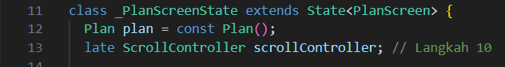
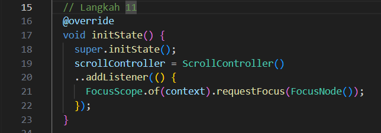
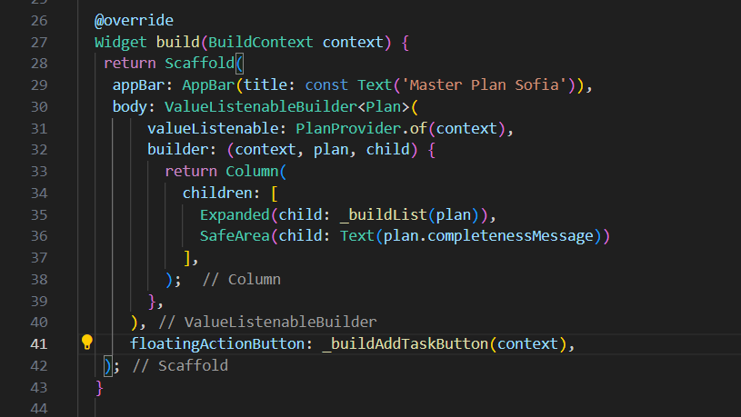

<span style="color: rgb(255, 100, 150);">
Nama    : Masyithah Sophia Damayanti <br>
Kelas   : TI-3C <br>
No      : 15 <br>
NIM     : 2241720011 <br>
</span> 

# Pertemuan 11 - Dasar State Management     

## Praktikum 1: Dasar State dengan Model-View               
### Langkah 1: Buat Project Baru        
 

### Langkah 2: Membuat model task.dart      
        
``` dart        
class Task {
  final String description;
  final bool complete;
  
  const Task({
    this.complete = false,
    this.description = '',
  });
}       
```             
### Langkah 3: Buat file plan.dart          
    

### Langkah 4: Buat file data_layer.dart        
 

### Langkah 5: Pindah ke file main.dart     
               

### Langkah 6: buat plan_screen.dart        
        
``` dart        
import '../models/data_layer.dart';
import 'package:flutter/material.dart';

class PlanScreen extends StatefulWidget {
  const PlanScreen({super.key});

  @override
  State createState() => _PlanScreenState();
}

class _PlanScreenState extends State<PlanScreen> {
  Plan plan = const Plan();

  @override
  Widget build(BuildContext context) {
   return Scaffold(
    // ganti ‘Namaku' dengan Nama panggilan Anda
    appBar: AppBar(title: const Text('Master Plan Sofia')),
    body: _buildList(),
    floatingActionButton: _buildAddTaskButton(),
   );
  }
}        
```     
### Langkah 7: buat method _buildAddTaskButton()        
        

### Langkah 8: buat widget _buildList()     
        
  
### Langkah 9: buat widget _buildTaskTile       
        
         
### Langkah 10: Tambah Scroll Controller        
       
 
### Langkah 11: Tambah Scroll Listener      
       

### Langkah 12: Tambah controller dan keyboard behavior     
       

### Langkah 13: Terakhir, tambah method dispose()       
       

##  Tugas Praktikum 1: Dasar State dengan Model-View        
1. Selesaikan langkah-langkah praktikum tersebut, lalu dokumentasikan berupa GIF hasil akhir praktikum beserta penjelasannya di file README.md! Jika Anda menemukan ada yang error atau tidak berjalan dengan baik, silakan diperbaiki.          

2. Jelaskan maksud dari langkah 4 pada praktikum tersebut! Mengapa dilakukan demikian?      
Jawab:          
* Langkah 4 bertujuan berfungsi sebagai pusat ekspor untuk semua model terkait, yaitu plan.dart dan task.dart.    
* Karena dilkukan untuk pendekatan yang berfungsi memproses impor menjadi lebih efisien,rapi, mempermudah pengelolaan data layer sehingga dapat mengurangi risiko kesalahan impor ganda, dan meningkatkan keterbacaan kode. 

3. Mengapa perlu variabel plan di langkah 6 pada praktikum tersebut? Mengapa dibuat konstanta ?     
Jawab:        
* Variabel plan berfungsi untuk menyimpan dan mengelola data yang akan ditampilkan dan dimodifikasi pada layar PlanScreen.
* Variabel ini dibuat sebagai konstanta agar nilai awalnya tetap dan tidak berubah, yang membantu menjaga stabilitas aplikasi sebelum ada data yang dimasukkan atau diubah oleh pengguna.

4. Lakukan capture hasil dari Langkah 9 berupa GIF, kemudian jelaskan apa yang telah Anda buat!     
Jawab:      
         

5. Apa kegunaan method pada Langkah 11 dan 13 dalam lifecyle state ?        
Jawab:      
* Langkah 11: initState() digunakan untuk mengaktifkan kontrol scroll saat layar dibuka.   
* Langkah 13: dispose() untuk membersihkan kontrol, saat layar ditutup sehingga aplikasi tetap efisien.

## Praktikum 2: Mengelola Data Layer dengan InheritedWidget dan InheritedNotifier       
### Langkah 1: Buat file plan_provider.dart     
   
``` dart        
import 'package:flutter/material.dart';
import '../models/data_layer.dart';

class PlanProvider extends InheritedNotifier<ValueNotifier<Plan>> {
  const PlanProvider({super.key, required Widget child, required
   ValueNotifier<Plan> notifier})
  : super(child: child, notifier: notifier);

  static ValueNotifier<Plan> of(BuildContext context) {
   return context.
    dependOnInheritedWidgetOfExactType<PlanProvider>()!.notifier!;
  }
}
```
### Langkah 2: Edit main.dart       
        
  
### Langkah 3: Tambah method pada model plan.dart       
        

### Langkah 4: Pindah ke PlanScreen     
        

### Langkah 6: Edit method _buildTaskTile       
        

### Langkah 7: Edit _buildList      
    

### Langkah 8: Tetap di class PlanScreen 

### Langkah 9: Tambah widget SafeArea
    
 
## Tugas Praktikum 2: InheritedWidget   
1. Selesaikan langkah-langkah praktikum tersebut, lalu dokumentasikan berupa GIF hasil akhir praktikum beserta penjelasannya di file README.md! Jika Anda menemukan ada yang error atau tidak berjalan dengan baik, silakan diperbaiki sesuai dengan tujuan aplikasi tersebut dibuat.   

2. Jelaskan mana yang dimaksud InheritedWidget pada langkah 1 tersebut! Mengapa yang digunakan InheritedNotifier?   
Jawab:        
* Pada langkah 1, PlanProvider berperan sebagai InheritedWidget, yang memungkinkan widget anak mengakses data tanpa perlu mengirim data secara eksplisit ke setiap widget.
* 'InheritedNotifier' dipilih karena, selain mewarisi fungsi InheritedWidget, dan widget akan memperbarui tampilan secara otomatis saat nilai notifier berubah. Jadi, setiap kali ValueNotifier<Plan> diperbarui, semua widget anak yang bergantung pada data Plan akan ikut diperbarui.

3. Jelaskan maksud dari method di langkah 3 pada praktikum tersebut! Mengapa dilakukan demikian?    
Jawab:    
* 'completedCount': Menghitung jumlah tugas yang telah selesai dalam daftar tasks.        
  'completenessMessage': Menghasilkan pesan yang menunjukkan jumlah tugas selesai dibandingkan dengan total tugas.
* Untuk memudahkan pemantauan kemajuan plan secara langsung, sehingga tampilan pada aplikasi dapat menampilkan informasi yang jelas tentang status penyelesaian tugas tanpa perlu dihitung lagi.

4. Lakukan capture hasil dari Langkah 9 berupa GIF, kemudian jelaskan apa yang telah Anda buat!   
Jawab:     

## Praktikum 3: Membuat State di Multiple Screens   
### Langkah 1: Edit PlanProvider    
    

### Langkah 2: Edit main.dart
    

### Langkah 3: Edit plan_screen.dart    
    
   
### Langkah 4: Error    

### Langkah 5: Tambah getter Plan   
    
 
### Langkah 6: Method initState()     
  

### Langkah 7: Widget build   


### Langkah 8: Edit _buildTaskTile    
    

### Langkah 9: Buat screen baru   
    
``` dart    
home: const PlanCreatorScreen(),
```     
### Langkah 10: Pindah ke class _PlanCreatorScreenState   

   
### Langkah 11: Pindah ke method build    


### Langkah 12: Buat widget _buildListCreator   
   

### Langkah 13: Buat void addPlan()   
   

### Langkah 14: Buat widget _buildMasterPlans()   
     

## Tugas Praktikum 3: State di Multiple Screens   
1. Selesaikan langkah-langkah praktikum tersebut, lalu dokumentasikan berupa GIF hasil akhir praktikum beserta penjelasannya di file README.md! Jika Anda menemukan ada yang error atau tidak berjalan dengan baik, silakan diperbaiki sesuai dengan tujuan aplikasi tersebut dibuat.   

2. Berdasarkan Praktikum 3 yang telah Anda lakukan, jelaskan maksud dari gambar diagram berikut ini!    
Jawab:    
* MaterialApp: Menginisialisasi aplikasi dan menjadi widget root yang membungkus seluruh aplikasi.    
* PlanProvider: Berfungsi menyimpan data terkait plan yang digunakan di dalam aplikasi, untuk mengakses data di seluruh widget.
* PlanCreatorScreen: Merupakan layar utama yang ditampilkan saat aplikasi dimulai, berisi:
  - Column: Menyusun elemen secara vertikal.
  - TextField: Untuk menginputkan teks rencana(plan).
  - Expanded: Menampung ListView yang menampilkan daftar rencana.    
* Navigator Push: Memindahkan pengguna dari PlanCreatorScreen ke PlanScreen.    
* Plan Screen
  - Scaffold: Struktur dasar layar yang menyediakan layout dan fitur seperti AppBar dan Drawer.
  - Column: Menyusun konten layar secara vertikal.    
  - Expanded: Menampung ListView untuk menampilkan daftar tugas.   
  - SafeArea: Memastikan konten tampil aman di area layar   
* Interaksi Pengguna: Pengguna dapat menambahkan rencana dan melihat daftar tugas setelah navigasi.

3. Lakukan capture hasil dari Langkah 14 berupa GIF, kemudian jelaskan apa yang telah Anda buat!    
Jawab: 
 

