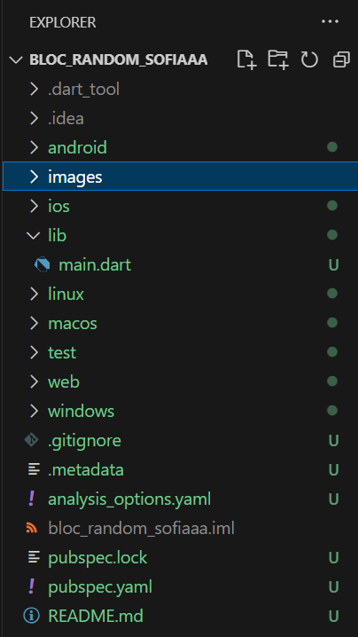
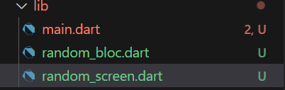
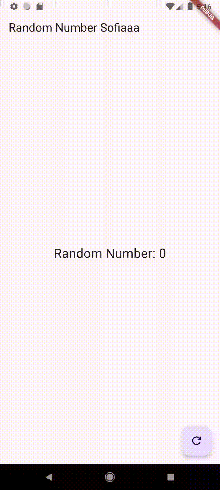

# Jobsheet 13 - Lanjutan State Management dengan Streams        

## Praktikum 7: BLoC Pattern        

### Langkah 1: Buat Project baru        
        

### Langkah 2: Isi kode random_bloc.dart        
``` dart        
import 'dart:async';
import 'dart:math';
```     

### Langkah 3: Buat class RandomNumberBloc()        
``` dart        
class RandomNumberBloc {}
```     

### Langkah 4: Buat variabel StreamController       
``` dart        
 // StreamController for input events
  final _generateRandomController = StreamController<void>();
  
  // StreamController for output
    final _randomNumberController = StreamController<int>();

  // Input Sink
    Sink<void> get generateRandom => _generateRandomController.sink;

  // Output Stream
```     

### Langkah 5: Buat constructor     
``` dart        
RandomNumberBloc() {
    // Mendengarkan input dari _generateRandomController
    _generateRandomController.stream.listen((_) {
      // Menghasilkan angka acak antara 0 dan 9
      final random = Random().nextInt(10);

      // Menambahkan angka acak ke _randomNumberController
      _randomNumberController.sink.add(random);
    });
  }     
```     

### Langkah 6: Buat method dispose()        
``` dart        
void dispose() {
    _generateRandomController.close();
    _randomNumberController.close();
  }
```     

### Langkah 7: Edit main.dart       
``` dart        
import 'package:bloc_random_sofiaaa/random_screen.dart';
import 'package:flutter/material.dart';

void main() {
  runApp(const MyApp());
}

class MyApp extends StatelessWidget {
  const MyApp({super.key});

  // This widget is the root of your application.
  @override
  Widget build(BuildContext context) {
    return MaterialApp(
      title: 'Flutter Demo',
      theme: ThemeData(
       primarySwatch: Colors.blue,
      ),
      home: const RandomScreen(),
    );
  }
}
```     

### Langkah 8: Buat file baru random_screen.dart        
        

### Langkah 9: Lakukan impor material dan random_bloc.dart      
``` dart        
import 'package:flutter/material.dart';
import 'random_bloc.dart';      
```     

### Langkah 10: Buat StatefulWidget RandomScreen
``` dart        
class RandomScreen extends StatefulWidget {
  const RandomScreen({super.key});

  @override
  State<RandomScreen> createState() => _RandomScreenState();
}       
```     

### Langkah 11: Buat variabel       
``` dart        
final _bloc = RandomNumberBloc();
```     

### Langkah 12: Buat method dispose()       
``` dart        
@override
  void dispose() {
    _bloc.dispose(); 
    super.dispose();
  }
```     

### Langkah 13: Edit method build()     
``` dart    
@override
  Widget build(BuildContext context) {
    return Scaffold(
      appBar: AppBar(
        title: const Text('Random Number Sofiaaa'),
      ),
      body: Center(
        child: StreamBuilder<int>(
          stream: _bloc.randomNumber,
          initialData: 0, // Nilai awal
          builder: (context, snapshot) {
              return Text(
                'Random Number: ${snapshot.data}',
                style: const TextStyle(fontSize: 24),
              );
            },         
          ),
        ),
      floatingActionButton: FloatingActionButton(
        onPressed: () => _bloc.generateRandom.add(null), // Memicu event generateRandom
        child: const Icon(Icons.refresh),
      ),
    );
  }
```       
Soal 13 dan Hasil:    
* Jelaskan maksud praktikum ini ! Dimanakah letak konsep pola BLoC-nya ?    
Jawab:      
- Tujuan: Untuk menerapkan pola arsitektur BLoC (Business Logic Component) untuk memisahkan logika bisnis dari UI.    

- Konsep BLoC:    
  - StreamController: Digunakan untuk mengelola input dan output.
  - Sink: Menerima input berupa event.
  - Stream: Memberikan output berupa angka acak ke UI.
  - StreamBuilder: Komponen Flutter untuk menghubungkan stream dengan widget.   

- Letak Konsep BLoC:    
  - Input event (tombol ditekan) diproses di BLoC (RandomNumberBloc).
  - Hasil (angka acak) dikirimkan ke UI melalui stream.
  - UI tidak memiliki logika untuk menghitung angka acak, tetapi hanya menampilkan data yang dikirim dari BLoC.   

* Capture hasil praktikum Anda berupa GIF dan lampirkan di README. Lalu lakukan commit dengan pesan "W13: Jawaban Soal 13".   
Hasil:      
    
     


