# Pertemuan 13 - Lanjutan State Management dengan Streams       
Nama    :   Masyithah Sophia Damayanti              
Kelas   :   TI-3C       
NIM     :   2241720011      
No      :   15      


##  Praktikum 1: Dart Streams       

### Langkah 1: Buat Project Baru        
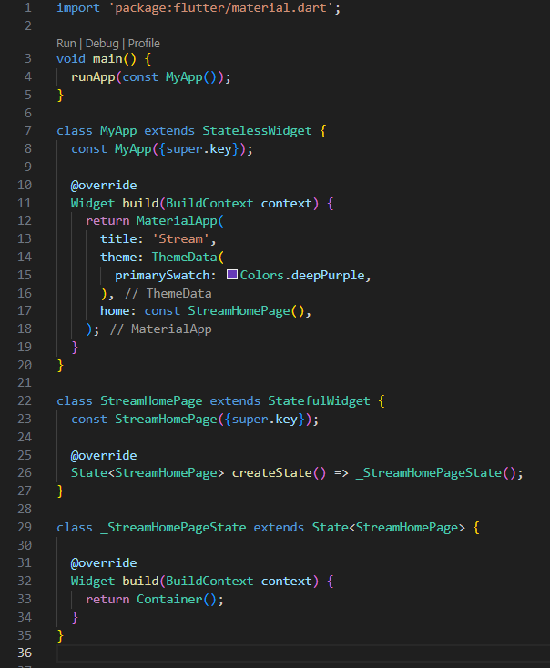        
``` dart    
import 'package:flutter/material.dart';

void main() {
  runApp(const MyApp());
}

class MyApp extends StatelessWidget {
  const MyApp({super.key});

  @override
  Widget build(BuildContext context) {
    return MaterialApp(
      title: 'Stream',
      theme: ThemeData(
        primarySwatch: Colors.deepPurple,
      ),
      home: const StreamHomePage(),
    );
  }
}

class StreamHomePage extends StatefulWidget {
  const StreamHomePage({super.key});

  @override
  State<StreamHomePage> createState() => _StreamHomePageState();
}

class _StreamHomePageState extends State<StreamHomePage> {

  @override
  Widget build(BuildContext context) {
    return Container();
  }
}           
```     

### Langkah 2: Buka file main.dart      
Soal 1 dan Hasil:            
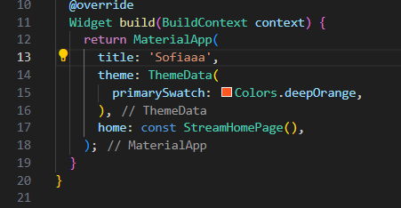            
* Kode Program nama panggilan       
``` dart     
return MaterialApp(
      title: 'Sofiaaa',   
```     
* Kode Program:             
``` dart
theme: ThemeData(
        primarySwatch: Colors.deepOrange,
      ),        
```     

### Langkah 3: Buat file baru stream.dart       
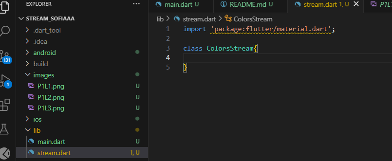        
``` dart        
import 'package:flutter/material.dart';   

class ColorsStream{
  
}
```

### Langkah 4: Tambah variabel colors       
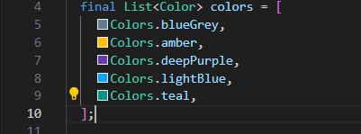        
``` dart        
import 'package:flutter/material.dart';   

class ColorsStream{
  final List<Color> colors = [
    Colors.blueGrey,
    Colors.amber,
    Colors.deepPurple,
    Colors.lightBlue,
    Colors.teal,        

  ];

}
```             
Soal 2 dan Hasil:      
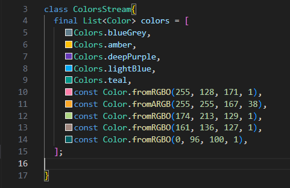          
``` dart        
    const Color.fromRGBO(255, 128, 171, 1),
    const Color.fromARGB(255, 255, 167, 38),
    const Color.fromRGBO(174, 213, 129, 1),
    const Color.fromRGBO(161, 136, 127, 1),
    const Color.fromRGBO(0, 96, 100, 1),
```     

### Langkah 5: Tambah method getColors()        
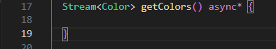        

### Langkah 6: Tambah perintah yield*       
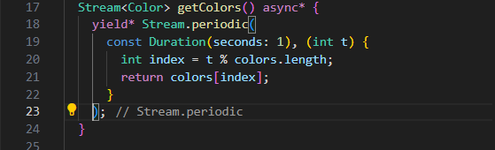        
Soal 3 dan Hasil:       
* Fungsi Keyword yield(*):    
untuk meneruskan elemen-elemen dari stream lain agar bisa dipancarkan dalam fungsi ini.         
* Penjelasan Kode Program:          
Kode untuk membuat stream yang setiap detik memancarkan warna dari daftar colors secara bergantian, sehingga warna-warna muncul berulang.           

### Langkah 7: Buka main.dart       
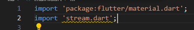        

### Langkah 8: Tambah variabel      
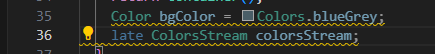        

### Langkah 9: Tambah method changeColor() 
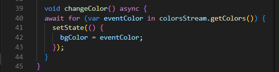     

### Langkah 10: Lakukan override initState()        
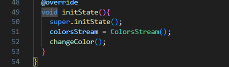           

### Langkah 11: Ubah isi Scaffold()     
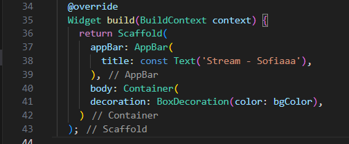       

### Langkah 12: Run     
     

### Langkah 13: Ganti isi method changeColor()      
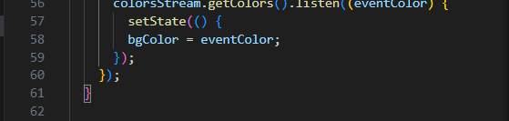       
Soal 5 dan Hasil:       
* await for: Menunggu setiap warna dari stream secara berurutan, dan fungsi tidak melanjutkan sampai stream selesai.        
* listen: Langsung merespons setiap warna yang muncul di stream tanpa menunggu seluruh stream selesai, cocok untuk pembaruan real-time.     

##  Praktikum 2: Stream controllers dan sinks       

### Langkah 1: Buka file stream.dart        
``` dart        
import 'dart:async';        
```

### Langkah 2: Tambah class NumberStream        
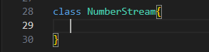        

### Langkah 3: Tambah StreamController      
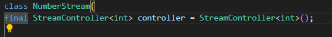        
``` dart        
final StreamController<int> controller = StreamController<int>();
```     

### Langkah 4: Tambah method addNumberToSink        
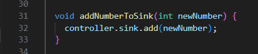    
``` dart        
 void addNumberToSink(int newNumber) {
    controller.sink.add(newNumber);
  }
```

### Langkah 5: Tambah method close()        
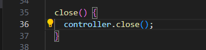        
``` dart        
 close() {
    controller.close();
  }
```     

### Langkah 6: Buka main.dart       
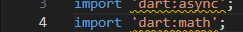        
``` dart        
import 'dart:async';
import 'dart:math';
```

### Langkah 7: Tambah variabel          
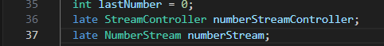            
``` dart        
int lastNumber = 0;
late StreamController numberStreamController;
late NumberStream numberStream;
```     

### Langkah 8: Edit initState()     
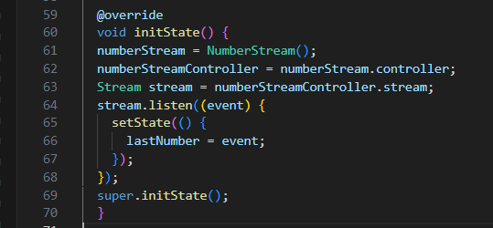        
``` dart        
@override
  void initState() {
  numberStream = NumberStream();
  numberStreamController = numberStream.controller;
  Stream stream = numberStreamController.stream;
  stream.listen((event) {
    setState(() {
      lastNumber = event;
    });
  });
  super.initState();
  }     
```     

### Langkah 9: Edit dispose()       
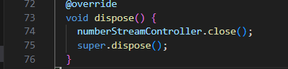            
``` dart        
  @override
  void dispose() {
    numberStreamController.close();
    super.dispose();
  }
```

### Langkah 10: Tambah method addRandomNumber()                 
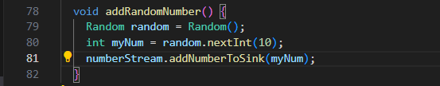       
``` dart        
void addRandomNumber() {
    Random random = Random();
    int myNum = random.nextInt(10);
    numberStream.addNumberToSink(myNum);
  }
```     

### Langkah 11: Edit method build()     \

``` dart        
 body: SizedBox(
        width: double.infinity,
        child: Column(
          mainAxisAlignment: MainAxisAlignment.spaceEvenly,
          crossAxisAlignment: CrossAxisAlignment.center,
          children: [
            Text(lastNumber.toString()),
            ElevatedButton(
              onPressed: () => addRandomNumber(),
              child: Text('New Random Number'),
            )
         ],
        ),  
      )
```         

### Langkah 12: Run
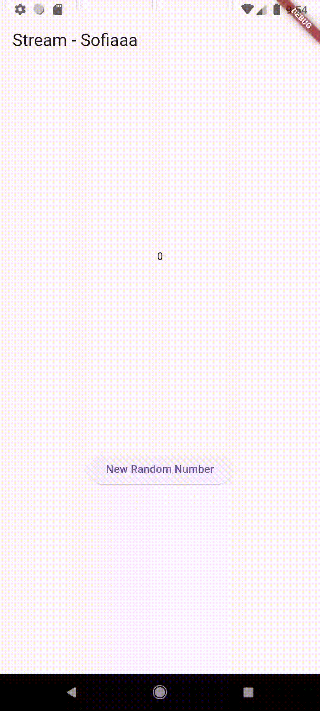   

### Langkah 13: Buka stream.dart    
``` dart    
addError() {
    controller.sink.addError('error');
  }
```   

### Langkah 14: Buka main.dart    
``` dart    
stream.listen((event) {
        setState(() {
          lastNumber = event;
        });
      },
      onError: (error) {
        setState(() {
          lastNumber = -1;
        });
      },
    );
  super.initState();
```   

### Langkah 15: Edit method addRandomNumber()  
``` dart   
  void addRandomNumber() {
    Random random = Random();
    numberStream.addError();
  }     
```     
Soal 7 dan Hasil:     
* Jelaskan maksud kode langkah 13 sampai 15 tersebut!   
Jawab:    
  - Langkah 13:   
  Metode addError() digunakan untuk memasukkan error ke dalam stream secara manual. Ini berguna untuk menguji pengelolaan error oleh aplikasi.    
  - Langkah 14:   
  onError pada listener diatur untuk menangani error yang diterima dari stream. Jika error diterima, nilai lastNumber diatur menjadi -1 untuk memberi tahu pengguna bahwa ada kesalahan.
  - Langkah 15:     
  Metode addRandomNumber() dimodifikasi untuk menggabungkan logika pengiriman data dan simulasi error. Jika angka acak kurang dari 5, aplikasi memicu error menggunakan addError(); jika tidak, angka acak dikirim ke stream seperti biasa.     

* Kembalikan kode seperti semula pada Langkah 15 
Jawab:    
Kode Program main.dart :      
``` dart      
import 'package:flutter/material.dart';
import 'stream.dart';
import 'dart:async';
import 'dart:math';

void main() {
  runApp(const MyApp());
}

class MyApp extends StatelessWidget {
  const MyApp({super.key});

  @override
  Widget build(BuildContext context) {
    return MaterialApp(
      title: 'Stream by Sofiaaa',
      theme: ThemeData(
        primarySwatch: Colors.teal, // Warna tema sesuai kesukaan
      ),
      home: const StreamHomePage(),
    );
    
  }
}

class StreamHomePage extends StatefulWidget {
  const StreamHomePage({super.key});

  @override
  State<StreamHomePage> createState() => _StreamHomePageState();
}

class _StreamHomePageState extends State<StreamHomePage> {
  Color bgColor = Colors.blueGrey;
  late ColorStream colorStream;
  @override
  Widget build(BuildContext context) {
    return Scaffold(
      appBar: AppBar(
        title: const Text('Stream by Sofiaaa'),
      ),
      body: SizedBox(
        width: double.infinity,
        child: Column(
          mainAxisAlignment: MainAxisAlignment.spaceEvenly,
          crossAxisAlignment: CrossAxisAlignment.center,
          children: [
            Text(
              lastNumber.toString(),
              style: const TextStyle(fontSize: 24),
            ),
            ElevatedButton(
              onPressed: addRandomNumber,
              child: const Text('New Random Number'),
            ),
          ],
        ),
      ),
    );
  }

  int lastNumber = 0;
  late StreamController numberStreamController;
  late NumberStream numberStream;
  
  @override
   void initState() {
    numberStream = NumberStream();
    numberStreamController = numberStream.controller;
    Stream stream = numberStreamController.stream;
    stream.listen((event) {
        setState(() {
          lastNumber = event;
        });
      },
      onError: (error) {
        setState(() {
          lastNumber = -1;
        });
      },
    );
    super.initState();
    // colorStream = ColorStream();
    // changeColor();
  }

  @override
    void dispose() {
      numberStreamController.close();
      super.dispose();
    }

  void changeColor() async {
      colorStream.getColors().listen((eventColor) {
       setState(() {
        bgColor = eventColor;
       });
      });
      // await for (var eventColor in colorStream.getColors()) {
      //   setState(() {
      //   bgColor = eventColor;
      //  });
      // }
    }

  void addRandomNumber() {
    Random random = Random();
    int myNum = random.nextInt(10);
    numberStream.addNumberToSink(myNum);
    // numberStream.addError();
  }
}
```       

kode program stream.dart:     
``` dart    
import 'package:flutter/material.dart';
import 'dart:async';

class ColorStream {
  final List<Color> colors = [
  Colors.blueGrey,
  Colors.amber,
  Colors.deepPurple,
  Colors.lightBlue,
  Colors.teal,

  // Warna tambahan
  const Color.fromRGBO(255, 128, 171, 1),
  const Color.fromARGB(255, 255, 167, 38),
  const Color.fromRGBO(174, 213, 129, 1),
  const Color.fromRGBO(161, 136, 127, 1),
  const Color.fromRGBO(0, 96, 100, 1)
  ];

  Stream<Color> getColors() async* {
    yield* Stream.periodic(
      const Duration(seconds: 1), (int t) {
        int index = t % colors.length;
       return colors[index];
    });
  }
}

class NumberStream {
  final StreamController<int> controller = StreamController<int>();
  void addNumberToSink(int newNumber) {
    controller.sink.add(newNumber);
  }

  close() {
    controller.close();
  }

  addError() {
    controller.sink.addError('error');
  }
}
```

* comment addError() agar Anda dapat melanjutkan ke praktikum 3 berikutnya.       
Jawab:       
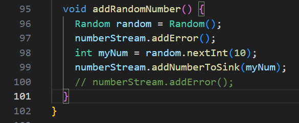       

## Praktikum 3: Injeksi data ke streams   

### Langkah 1: Buka main.dart     
``` dart      
late StreamTransformer transformer;
```     

### Langkah 2: Tambahkan kode ini di initState      
``` dart   
final transformer = StreamTransformer<int, int>.fromHandlers(
        handleData: (value, sink) {
          sink.add(value * 10);
        },
        handleError: (error, trace, sink) {
          sink.add(-1);
        },
        handleDone: (sink) => sink.close()
    );    
```         

### Langkah 3: Tetap di initState     
``` dart    
stream.transform(transformer).listen((event) {
        setState(() {
          lastNumber = event;
        });
      },
      onError: (error) {
        setState(() {
          lastNumber = -1;
        });
      },
    );
    super.initState();
```     
###  Langkah 4: Run         
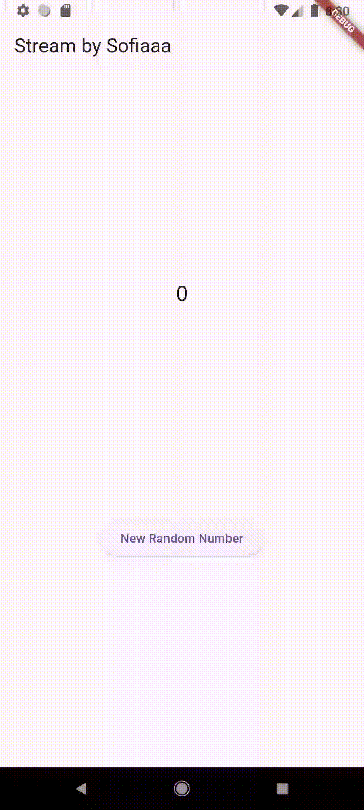   

## Praktikum 4: Subscribe ke stream events    

### Langkah 1: Tambah variabel    
``` dart    
late StreamSubscription subscription;   
```

### Langkah 2: Edit initState() 
``` dart
void initState() {
    super.initState();
    numberStream = NumberStream();
    numberStreamController = numberStream.controller;

    // Menyusun stream dan mendengarkan perubahan data
    Stream stream = numberStreamController.stream;
    subscription = stream.listen((event) {
      setState(() {
        lastNumber = event;
        });
      });
      super.initState();
    }   
```   

### Langkah 3: Tetap di initState()     
``` dart    
subscription.onError((error) {
        setState(() {
          lastNumber = -1;
        });
      });
```       

### Langkah 4: Tambah properti onDone()     
``` dart    
subscription.onDone(() {
  print('OnDone was called');
});
```   

### Langkah 5: Tambah method baru   
``` dart
 void stopStream() {
  numberStreamController.close();
}   
``` 

### Langkah 6: Pindah ke method dispose()   
``` dart    
@override
  void dispose() {
    subscription.cancel();
    super.dispose();
  }   
```

### Langkah 7: Pindah ke method build()     
``` dart    
 ElevatedButton(
    onPressed: () => stopStream,
    child: const Text('Stop Subscription'),
  ),
```   

### Langkah 8: Edit method addRandomNumber()    
``` dart    
 void addRandomNumber() {
  Random random = Random();
  int myNum = random.nextInt(10);
  if (!numberStreamController.isClosed) {
    numberStream.addNumberToSink(myNum);
  } else {
    setState(() {
       lastNumber = -1;
      });
    }
  }
```   

### Langkah 9: Run    
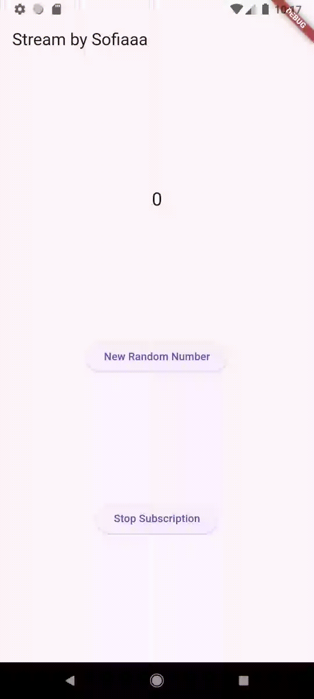   

### Langkah 10: Tekan button ‘Stop Subscription'    
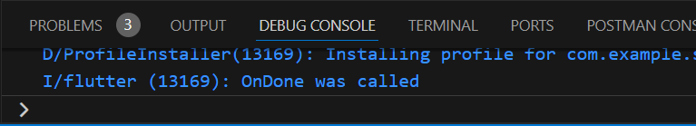   

Soal 9 dan Hasil:     
* Jelaskan maksud kode langkah 2, 6 dan 8 tersebut!   
  - Langkah 2:    
  Kode ini menginisialisasi stream dan mendengarkan perubahan data yang dikirimkan oleh stream. Ketika data baru diterima, setState() dipanggil untuk memperbarui UI.

  - Langkah 6:    
  Pada langkah ini, kita membatalkan subscription pada stream ketika widget dibuang (dispose()) untuk mencegah kebocoran memori dan memastikan tidak ada data yang diterima lagi setelah widget dihapus.    
  
  - Langkah 8:    
  Kode ini memeriksa apakah StreamController masih terbuka sebelum menambahkan data baru ke stream. Jika stream sudah ditutup, nilai lastNumber diperbarui untuk menandakan kesalahan.    

* Capture hasil praktikum Anda berupa GIF dan lampirkan di README.      
Hasil:    
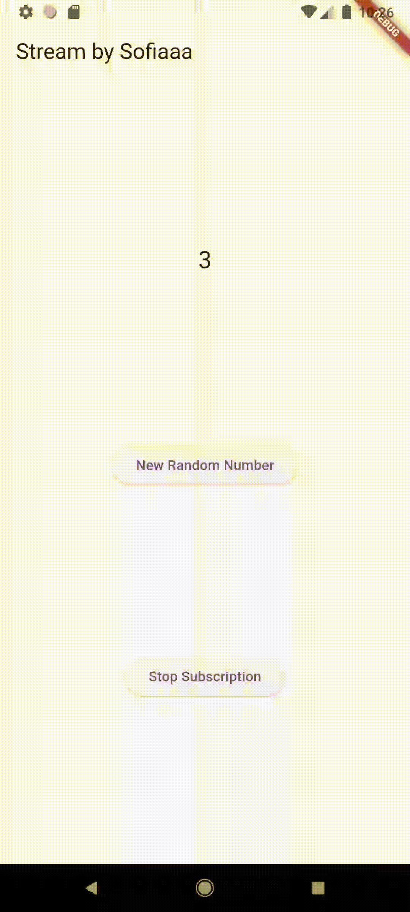    

## Praktikum 5: Multiple stream subscriptions     

### Langkah 1: Buka file main.dart    
``` dart    
late StreamSubscription subscription2;
String values = '';
```   

### Langkah 2: Edit initState()   
``` dart    
Stream stream = numberStreamController.stream;
      subscription = stream.listen((event) {
      setState(() {
      values += '$event -';
      // lastNumber = event;
      });
    });
    subscription = stream.listen((event) {
      setState(() {
        values += '$event -';
      });
    });   
```     

### Langkah 3: Run        
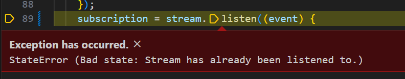        

Soal 10 dan Hasil:          
Error terjadi karena variabel subscription diinisialisasi dua kali untuk stream yang sama, yang menyebabkan konflik dalam mendengarkan data. Untuk memperbaikinya, hanya satu subscription yang dibutuhkan untuk stream, dan kedua pembaruan dapat dilakukan dalam satu listener.   

### Langkah 4: Set broadcast stream   
``` dart    
 Stream stream = numberStreamController.stream.asBroadcastStream();   
```     

### Langkah 5: Edit method build()    
``` dart    
child: Column(
          mainAxisAlignment: MainAxisAlignment.spaceEvenly,
          crossAxisAlignment: CrossAxisAlignment.center,
          children: [
            Text(values), 
```   

### Langkah 6: Run        
Soal 11 dan Hasil:    
* Jelaskan mengapa hal itu bisa terjadi ?   
Jawab:    
Hal ini terjadi karena setelah stream diubah menjadi broadcast stream, event yang sama diterima oleh lebih dari satu listener. Oleh karena itu, setiap event yang dihasilkan akan diproses oleh semua listener, menyebabkan pembaruan pada UI dua kali.   

* Capture hasil praktikum Anda berupa GIF dan lampirkan di README.      
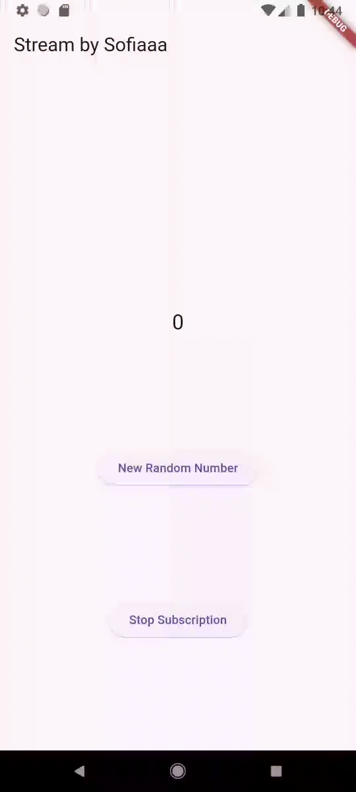      


