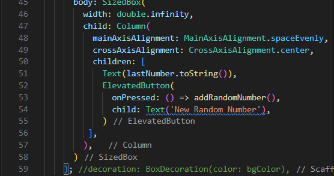

# Pertemuan 13 - Lanjutan State Management dengan Streams       
Nama    :   Masyithah Sophia Damayanti              
Kelas   :   TI-3C       
NIM     :   2241720011      
No      :   15      


##  Praktikum 1: Dart Streams       

### Langkah 1: Buat Project Baru        
        
``` dart    
import 'package:flutter/material.dart';

void main() {
  runApp(const MyApp());
}

class MyApp extends StatelessWidget {
  const MyApp({super.key});

  @override
  Widget build(BuildContext context) {
    return MaterialApp(
      title: 'Stream',
      theme: ThemeData(
        primarySwatch: Colors.deepPurple,
      ),
      home: const StreamHomePage(),
    );
  }
}

class StreamHomePage extends StatefulWidget {
  const StreamHomePage({super.key});

  @override
  State<StreamHomePage> createState() => _StreamHomePageState();
}

class _StreamHomePageState extends State<StreamHomePage> {

  @override
  Widget build(BuildContext context) {
    return Container();
  }
}           
```     

### Langkah 2: Buka file main.dart      
Soal 1 dan Hasil:            
            
* Kode Program nama panggilan       
``` dart     
return MaterialApp(
      title: 'Sofiaaa',   
```     
* Kode Program:             
``` dart
theme: ThemeData(
        primarySwatch: Colors.deepOrange,
      ),        
```     

### Langkah 3: Buat file baru stream.dart       
        
``` dart        
import 'package:flutter/material.dart';   

class ColorsStream{
  
}
```

### Langkah 4: Tambah variabel colors       
        
``` dart        
import 'package:flutter/material.dart';   

class ColorsStream{
  final List<Color> colors = [
    Colors.blueGrey,
    Colors.amber,
    Colors.deepPurple,
    Colors.lightBlue,
    Colors.teal,        

  ];

}
```             
Soal 2 dan Hasil:      
          
``` dart        
    const Color.fromRGBO(255, 128, 171, 1),
    const Color.fromARGB(255, 255, 167, 38),
    const Color.fromRGBO(174, 213, 129, 1),
    const Color.fromRGBO(161, 136, 127, 1),
    const Color.fromRGBO(0, 96, 100, 1),
```     

### Langkah 5: Tambah method getColors()        
        

### Langkah 6: Tambah perintah yield*       
        
Soal 3 dan Hasil:       
* Fungsi Keyword yield(*):    
untuk meneruskan elemen-elemen dari stream lain agar bisa dipancarkan dalam fungsi ini.         
* Penjelasan Kode Program:          
Kode untuk membuat stream yang setiap detik memancarkan warna dari daftar colors secara bergantian, sehingga warna-warna muncul berulang.           

### Langkah 7: Buka main.dart       
        

### Langkah 8: Tambah variabel      
        

### Langkah 9: Tambah method changeColor() 
     

### Langkah 10: Lakukan override initState()        
           

### Langkah 11: Ubah isi Scaffold()     
       

### Langkah 12: Run     
     

### Langkah 13: Ganti isi method changeColor()      
       
Soal 5 dan Hasil:       
* await for: Menunggu setiap warna dari stream secara berurutan, dan fungsi tidak melanjutkan sampai stream selesai.        
* listen: Langsung merespons setiap warna yang muncul di stream tanpa menunggu seluruh stream selesai, cocok untuk pembaruan real-time.     

##  Praktikum 2: Stream controllers dan sinks       

### Langkah 1: Buka file stream.dart        
``` dart        
import 'dart:async';        
```

### Langkah 2: Tambah class NumberStream        
        

### Langkah 3: Tambah StreamController      
        
``` dart        
final StreamController<int> controller = StreamController<int>();
```     

### Langkah 4: Tambah method addNumberToSink        
    
``` dart        
 void addNumberToSink(int newNumber) {
    controller.sink.add(newNumber);
  }
```

### Langkah 5: Tambah method close()        
        
``` dart        
 close() {
    controller.close();
  }
```     

### Langkah 6: Buka main.dart       
        
``` dart        
import 'dart:async';
import 'dart:math';
```

### Langkah 7: Tambah variabel          
            
``` dart        
int lastNumber = 0;
late StreamController numberStreamController;
late NumberStream numberStream;
```     

### Langkah 8: Edit initState()     
        
``` dart        
@override
  void initState() {
  numberStream = NumberStream();
  numberStreamController = numberStream.controller;
  Stream stream = numberStreamController.stream;
  stream.listen((event) {
    setState(() {
      lastNumber = event;
    });
  });
  super.initState();
  }     
```     

### Langkah 9: Edit dispose()       
            
``` dart        
  @override
  void dispose() {
    numberStreamController.close();
    super.dispose();
  }
```

### Langkah 10: Tambah method addRandomNumber()                 
       
``` dart        
void addRandomNumber() {
    Random random = Random();
    int myNum = random.nextInt(10);
    numberStream.addNumberToSink(myNum);
  }
```     

### Langkah 11: Edit method build()     \

``` dart        
 body: SizedBox(
        width: double.infinity,
        child: Column(
          mainAxisAlignment: MainAxisAlignment.spaceEvenly,
          crossAxisAlignment: CrossAxisAlignment.center,
          children: [
            Text(lastNumber.toString()),
            ElevatedButton(
              onPressed: () => addRandomNumber(),
              child: Text('New Random Number'),
            )
         ],
        ),  
      )
```         

### Langkah 12: Run
   

### Langkah 13: Buka stream.dart    
``` dart    
addError() {
    controller.sink.addError('error');
  }
```   

### Langkah 14: Buka main.dart    
``` dart    
stream.listen((event) {
        setState(() {
          lastNumber = event;
        });
      },
      onError: (error) {
        setState(() {
          lastNumber = -1;
        });
      },
    );
  super.initState();
```   

### Langkah 15: Edit method addRandomNumber()  
``` dart   
  void addRandomNumber() {
    Random random = Random();
    numberStream.addError();
  }     
```     
Soal 7 dan Hasil:     
* Jelaskan maksud kode langkah 13 sampai 15 tersebut!   
Jawab:    
  - Langkah 13:   
  Metode addError() digunakan untuk memasukkan error ke dalam stream secara manual. Ini berguna untuk menguji pengelolaan error oleh aplikasi.    
  - Langkah 14:   
  onError pada listener diatur untuk menangani error yang diterima dari stream. Jika error diterima, nilai lastNumber diatur menjadi -1 untuk memberi tahu pengguna bahwa ada kesalahan.
  - Langkah 15:     
  Metode addRandomNumber() dimodifikasi untuk menggabungkan logika pengiriman data dan simulasi error. Jika angka acak kurang dari 5, aplikasi memicu error menggunakan addError(); jika tidak, angka acak dikirim ke stream seperti biasa.     

* Kembalikan kode seperti semula pada Langkah 15 
Jawab:    
Kode Program main.dart :      
``` dart      
import 'package:flutter/material.dart';
import 'stream.dart';
import 'dart:async';
import 'dart:math';

void main() {
  runApp(const MyApp());
}

class MyApp extends StatelessWidget {
  const MyApp({super.key});

  @override
  Widget build(BuildContext context) {
    return MaterialApp(
      title: 'Stream by Sofiaaa',
      theme: ThemeData(
        primarySwatch: Colors.teal, // Warna tema sesuai kesukaan
      ),
      home: const StreamHomePage(),
    );
    
  }
}

class StreamHomePage extends StatefulWidget {
  const StreamHomePage({super.key});

  @override
  State<StreamHomePage> createState() => _StreamHomePageState();
}

class _StreamHomePageState extends State<StreamHomePage> {
  Color bgColor = Colors.blueGrey;
  late ColorStream colorStream;
  @override
  Widget build(BuildContext context) {
    return Scaffold(
      appBar: AppBar(
        title: const Text('Stream by Sofiaaa'),
      ),
      body: SizedBox(
        width: double.infinity,
        child: Column(
          mainAxisAlignment: MainAxisAlignment.spaceEvenly,
          crossAxisAlignment: CrossAxisAlignment.center,
          children: [
            Text(
              lastNumber.toString(),
              style: const TextStyle(fontSize: 24),
            ),
            ElevatedButton(
              onPressed: addRandomNumber,
              child: const Text('New Random Number'),
            ),
          ],
        ),
      ),
    );
  }

  int lastNumber = 0;
  late StreamController numberStreamController;
  late NumberStream numberStream;
  
  @override
   void initState() {
    numberStream = NumberStream();
    numberStreamController = numberStream.controller;
    Stream stream = numberStreamController.stream;
    stream.listen((event) {
        setState(() {
          lastNumber = event;
        });
      },
      onError: (error) {
        setState(() {
          lastNumber = -1;
        });
      },
    );
    super.initState();
    // colorStream = ColorStream();
    // changeColor();
  }

  @override
    void dispose() {
      numberStreamController.close();
      super.dispose();
    }

  void changeColor() async {
      colorStream.getColors().listen((eventColor) {
       setState(() {
        bgColor = eventColor;
       });
      });
      // await for (var eventColor in colorStream.getColors()) {
      //   setState(() {
      //   bgColor = eventColor;
      //  });
      // }
    }

  void addRandomNumber() {
    Random random = Random();
    int myNum = random.nextInt(10);
    numberStream.addNumberToSink(myNum);
    // numberStream.addError();
  }
}
```       

kode program stream.dart:     
``` dart    
import 'package:flutter/material.dart';
import 'dart:async';

class ColorStream {
  final List<Color> colors = [
  Colors.blueGrey,
  Colors.amber,
  Colors.deepPurple,
  Colors.lightBlue,
  Colors.teal,

  // Warna tambahan
  const Color.fromRGBO(255, 128, 171, 1),
  const Color.fromARGB(255, 255, 167, 38),
  const Color.fromRGBO(174, 213, 129, 1),
  const Color.fromRGBO(161, 136, 127, 1),
  const Color.fromRGBO(0, 96, 100, 1)
  ];

  Stream<Color> getColors() async* {
    yield* Stream.periodic(
      const Duration(seconds: 1), (int t) {
        int index = t % colors.length;
       return colors[index];
    });
  }
}

class NumberStream {
  final StreamController<int> controller = StreamController<int>();
  void addNumberToSink(int newNumber) {
    controller.sink.add(newNumber);
  }

  close() {
    controller.close();
  }

  addError() {
    controller.sink.addError('error');
  }
}
```

* comment addError() agar Anda dapat melanjutkan ke praktikum 3 berikutnya.       
Jawab:       
       


