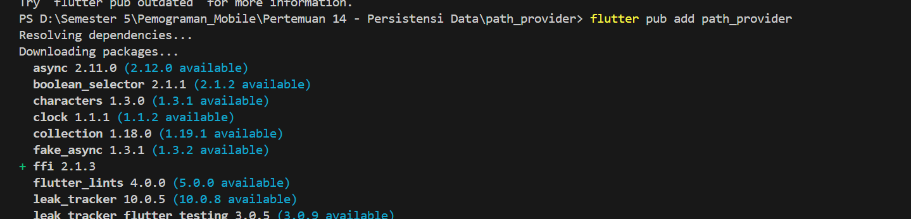
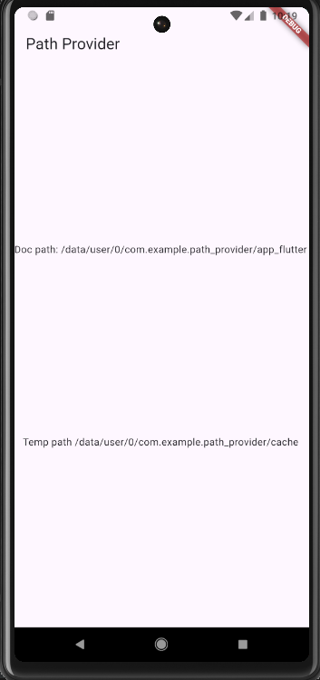
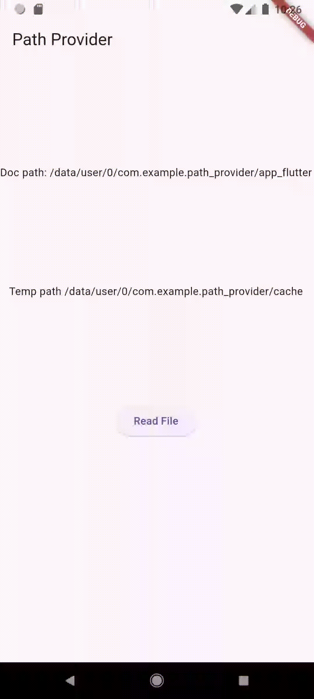

# Jobsheet 14 - Persistensi Data            
Nama        : Masyithah Sophia Damayanti        
Kelas       : TI-3C     
No          : 15        
NIM         : 2241720011   

## Praktikum 4: Accessing the filesystem, part 1: path_provider     

### Menambahkan dependency yang relevan ke file pubspec.yaml. Tambahkan path_provider dengan mengetikkan perintah ini dari Terminal Anda:           
            

### Di bagian atas file main.dart, tambahkan impor path_provider:       
``` dart        
import 'package:path_provider/path_provider.dart';      
```     

### Di bagian atas kelas _MyHomePageState, tambahkan variabel State yang akan kita gunakan untuk memperbarui antarmuka pengguna:            
``` dart        
String documentsPath='';
  String tempPath = '';
```         

### Masih dalam kelas _MyHomePageState, tambahkan metode untuk mengambil direktori temporary dan dokumen:       
``` dart        
Future getPaths() async{
    final docDir = await getApplicationDocumentsDirectory();
    final tempDir = await getTemporaryDirectory();
    setState(() {
      documentsPath = docDir.path;
      tempPath = tempDir.path;
    });
  }
```     

### Pada metode initState dari kelas _MyHomePageState, panggil metode getPaths:     
``` dart        
@override
  void initState(){
    super.initState();
    getPaths();
  }
```     

### Pada metode build _MyHomePageState, buat UI dengan dua widget Teks yang menunjukkan path yang diambil:      
``` dart        
@override
  Widget build(BuildContext context){
    return Scaffold(
      appBar: AppBar(title: const Text('Path Provider')),
      body: Column(
        mainAxisAlignment: MainAxisAlignment.spaceEvenly,
        children: [
          Text('Doc path: $documentsPath'),
          Text('Temp path $tempPath'),
        ],
      ),
    );
  }
```     

### Jalankan aplikasi. Anda akan melihat layar yang terlihat seperti berikut ini:       
        

## Praktikum 5: Accessing the filesystem, part 2: Working with directories      

### Di bagian atas berkas main.dart, impor pustaka dart:io:     
``` dart        
import 'dart:io';       
```     

### Di bagian atas kelas _MyHomePageState, di file main.dart, buat dua variabel State baru untuk file dan isinya:       
``` dart        
late File myFile;
String fileText = '';
```     

### Masih dalam kelas MyHomePageState, buat metode baru bernama writeFile dan gunakan kelas File dari pustaka dart:io untuk membuat file baru:      
``` dart        
Future<bool> writeFile() async{
    try{
      await myFile.writeAsString('Margherita, Capricciosa, Napoli');
      return true;
    }catch(e){
      return false;
    }
  }
```     

### Dalam metode initState, setelah memanggil metode getPaths, dalam metode then, buat sebuah file dan panggil metode writeFile:        
``` dart        
 @override
  void initState(){
    super.initState();
    getPaths().then((_){
      myFile = File('$documentsPath/pizzas.txt');
      writeFile();
    });
  }
```     

### Buat metode untuk membaca file:     
``` dart        
Future<bool> readFile() async{
    try{
      String fileContent = await myFile.readAsString();
      setState(() {
        fileText =fileContent;
      });
      return true;
    }catch(e){
      return false;
    }
  }
```     

### Dalam metode build, di widget Column, perbarui antarmuka pengguna dengan ElevatedButton. Ketika pengguna menekan tombol, tombol akan mencoba membaca konten file dan menampilkannya di layar, cek kode cetak tebal:     
``` dart        
children: [
          Text('Doc path: $documentsPath'),
          Text('Temp path $tempPath'),
          ElevatedButton(
            onPressed: () => readFile(), 
            child: const Text('Read File')
          ),
          Text(fileText),
        ],
```     

### Jalankan aplikasi dan tekan tombol Baca File. Di bawah tombol tersebut, Anda akan melihat teks Margherita, Capricciosa, Napoli, seperti yang ditunjukkan pada tangkapan layar berikut:      
Hasil:              
        

     


