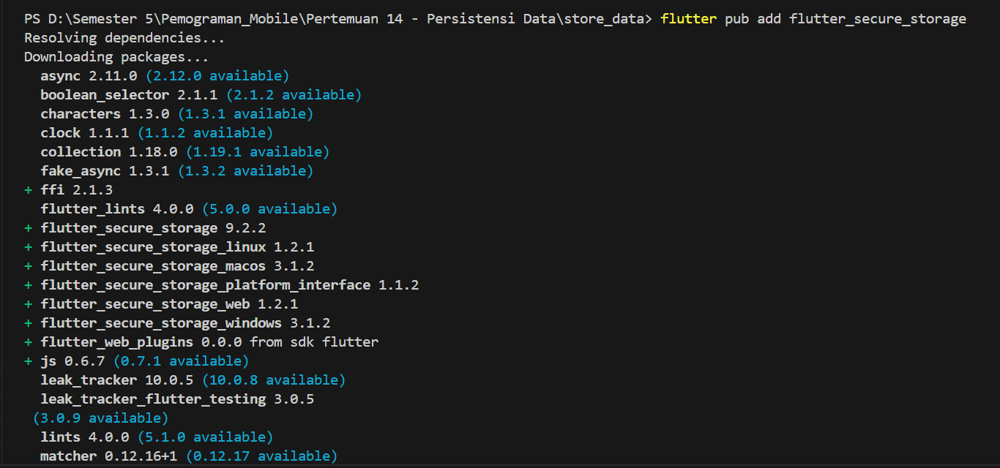

# Pertemuan 14 - Persistensi Data       
Nama    : Masyithah Sophia Damayanti            
Kelas   : TI-3C     
No      : 15        
NIM     : 2241720011        

## Praktikum 1: Converting Dart models into JSON        

### Di editor favorit Anda, buat proyek Flutter baru dan beri nama store_data               
Hasil:      
        

### Pada file main.dart, hapus kode yang ada dan tambahkan kode awal untuk aplikasi dengan kode berikut:        
``` dart        
import 'package:flutter/material.dart';

void main() {
  runApp(const MyApp());
}

class MyApp extends StatelessWidget {
  const MyApp({super.key});

  // This widget is the root of your application.
  @override
  Widget build(BuildContext context) {
    return MaterialApp(
      title: 'Flutter JSON Demo',
      theme: ThemeData(
        primarySwatch: Colors.blue,
      ),
      home: const MyHomePage(),
    );
  }
}

class MyHomePage extends StatefulWidget {
  const MyHomePage({super.key});

  @override
  State<MyHomePage> createState() => _MyHomePageState();
}

class _MyHomePageState extends State<MyHomePage> {
  @override
  Widget build(BuildContext context) {
    return Scaffold(
      appBar: AppBar(title: const Text('JSON')),
      body: Container(),
    );
  }  
}
```             

###  Tambahkan folder baru ke root proyek Anda dengan nama assets.          
        

###  Di dalam folder aset, buat file baru bernama pizzalist.json dan salin konten yang tersedia di tautan https://gist.github.com/simoales/a33c1c2abe78b48a75ccfd5fa0de0620. File ini berisi daftar objek JSON.     
        
``` dart        
[ 
    { 
      "id": 1, 
      "pizzaName": "Margherita", 
      "description": "Pizza with tomato, fresh mozzarella and basil",
      "price": 8.75, 
      "imageUrl": "images/margherita.png" 
    }, 
    { 
      "id": 2, 
      "pizzaName": "Marinara", 
      "description": "Pizza with tomato, garlic and oregano",
      "price": 7.50, 
      "imageUrl": "images/marinara.png"  
    }, 
    { 
      "id": 3, 
      "pizzaName": "Napoli", 
      "description": "Pizza with tomato, garlic and anchovies",
      "price": 9.50, 
      "imageUrl": "images/marinara.png"  
    }, 
    { 
      "id": 4, 
      "pizzaName": "Carciofi", 
      "description": "Pizza with tomato, fresh mozzarella and artichokes",
      "price": 8.80, 
      "imageUrl": "images/marinara.png"  
    }, 
    { 
      "id": 5, 
      "pizzaName": "Bufala", 
      "description": "Pizza with tomato, buffalo mozzarella and basil",
      "price": 12.50, 
      "imageUrl": "images/marinara.png"  
    }
   ]
```

### Di file pubspec.yaml, tambahkan referensi ke folder aset baru, seperti yang ditunjukkan di sini:
        

### Pada kelas _MyHomePageState, di main.dart, tambahkan sebuah variabel state bernama pizzaString:     
``` dart        
String pizzaString ='';     
```         

### Untuk membaca isi file pizzalist.json, di bagian bawah kelas _MyHomePageState di main.dart, tambahkan metode asinkron baru yang disebut readJsonFile, yang akan mengatur nilai pizzaString, seperti yang ditunjukkan di sini:           
``` dart        
Future readJsonFile() async{
  String myString = await DefaultAssetBundle.of(context)
  .loadString('assets/pizzalist.json');
  setState((){
    pizzaString = myString;
  });
}
```     

### Pada kelas _MyHomePageState, timpa metode initState dan, di dalamnya, panggil metode readJsonFile:      
``` dart        
@override   
  void initState() {
    super.initState();
    readJsonFile();
  }
Future readJsonFile() async{
  String myString = await DefaultAssetBundle.of(context)
  .loadString('assets/pizzalist.json');
  setState((){
    pizzaString = myString;
  });
}
```     

### Sekarang, kita ingin menampilkan JSON yang diambil di properti dalam Scaffold. Untuk melakukannya, tambahkan widget Teks sebagai child dari Container kita:     
       

### Kita ingin mengubah String ini menjadi sebuah List of Objects. Kita akan mulai dengan membuat kelas baru. Dalam folder lib aplikasi kita, buat file baru bernama pizza.dart.        
        

### Di dalam file tersebut, tentukan properti kelas Pizza:      
``` dart        
class Pizza {
  final int id;
  final String pizzaName;
  final String description;
  final double price;
  final String imageUrl;
}
```         

### Di dalam kelas Pizza, tentukan konstruktor bernama fromJson, yang akan mengambil sebuah Map sebagai parameter dan mengubah Map menjadi sebuah instance dari Pizza:      
``` dart        
 Pizza.fromJson(Map<String, dynamic> json) : 
  id = json['id'],
  pizzaName = json['pizzaName'],
  description = json['description'],
  price = json['price'],
  imageUrl = json['imageUrl'];
```             

### Refaktor metode readJsonFile() pada kelas _MyHomePageState. Langkah pertama adalah mengubah String menjadi Map dengan memanggil metode jsonDecode. Pada method readJsonFile, tambahkan kode yang di cetak tebal berikut ini:            
``` dart        
Future readJsonFile() async{
    String myString = await DefaultAssetBundle.of(context)
    .loadString('assets/pizzalist.json');
    List pizzaMapList = jsonDecode(myString);
    setState((){
      pizzaString = myString;
    });
  }     
```     

### Pastikan editor Anda secara otomatis menambahkan pernyataan impor untuk pustaka "dart:convert" di bagian atas file main.dart; jika tidak, tambahkan saja secara manual. Tambahkan juga pernyataan impor untuk kelas pizza:      
``` dart        
import 'dart:convert';
import './pizza.dart';      
```     

### Langkah terakhir adalah mengonversi string JSON kita menjadi List of native Dart objects. Kita dapat melakukan ini dengan mengulang pizzaMapList dan mengubahnya menjadi objek Pizza. Di dalam metode readJsonFile, di bawah metode jsonDecode, tambahkan kode berikut:     
``` dart        
List<Pizza> myPizzas = [];
    for (var pizza in pizzaMapList) {
      Pizza myPizza = Pizza.fromJson(pizza);
      myPizzas.add(myPizza);
    }           
```         

### Hapus atau beri komentar pada metode setState yang mengatur String pizzaString dan kembalikan daftar objek Pizza sebagai gantinya:      
``` dart        
return myPizzas;        
```     

### Ubah signature metode sehingga Anda dapat menampilkan nilai balik secara eksplisit:          
``` dart        
Future <List<Pizza>> readJsonFile() async{      
```         

### Sekarang kita memiliki objek List of Pizza. Daripada hanya menampilkan sebuah Teks kepada pengguna, kita dapat menampilkan sebuah ListView yang berisi sekumpulan widget ListTile. Di bagian atas kelas _MyHomePageState, buat List<Pizza> bernama myPizzas:        
``` dart        
List<Pizza> myPizzas = [];      
```     

### Dalam metode initState, pastikan Anda mengatur myPizzas dengan hasil panggilan ke readJsonFile:     
``` dart        
@override   
  void initState() {
    super.initState();
    readJsonFile().then((value)) {
      setState(() {
        myPizzas = value;
      });
    };
  }
```     

### Tambahkan kode berikut ini di dalam Scaffold, di dalam metode build():      
``` dart        
@override
  Widget build(BuildContext context) {
    return Scaffold(
      appBar: AppBar(title: const Text('JSON')),
      body: ListView.builder(
        itemCount: myPizzas.length,   
        itemBuilder: (context, index) {
          return ListTile(
            title: Text(myPizzas[index]. pizzaName),
            subtitle: Text(myPizzas[index].description),
          );
        },
      ),
      // body: Container(),
    );
  }         
```     

### Jalankan aplikasi. Antarmuka pengguna sekarang seharusnya jauh lebih ramah dan terlihat seperti yang ditunjukkan pada:      
       

## B. Praktikum 2: Reading the JSON file        

### Tambahkan metode baru ke kelas Pizza, di file pizza.dart, yang disebut toJson. Ini akan mengembalikan sebuah Map<String, dynamic> dari objek:       
``` dart        
Map <String, dynamic> toJson() {
    return {
      'id': id,
      'pizzaName': pizzaName,
      'description': description,
      'price': price,
      'imageUrl': imageUrl,
    };
  }
```     

### Setelah Anda memiliki sebuah Map, Anda dapat menserialisasikannya kembali ke dalam string JSON. Tambahkan metode baru di di bagian bawah kelas _MyHomePageState, di dalam file main.dart, yang disebut convertToJSON:       
``` dart        
String convertToJSON(List<Pizza> pizzas) {
      return jsonEncode(pizzas.map((pizza) => jsonEncode(pizza)).
      toList());
    }
```     

### Metode ini mengubah objek List of Pizza kembali menjadi string Json dengan memanggil metode jsonEncode lagi di pustaka dart_convert.        

### Terakhir, mari panggil metode tersebut dan cetak string JSON di Debug Console. Tambahkan kode berikut ke metode readJsonFile, tepat sebelum mengembalikan List myPizzas:        
``` dart        
String json = convertToJSON(myPizzas);
    print(json);
    return myPizzas;
```     

### Jalankan aplikasi. Anda akan melihat string JSON dicetak, seperti yang ditunjukkan pada gambar berikut:     
        

## Praktikum 6: Using secure storage to store data    

### Tambahkan flutter_secure_storage ke proyek Anda, dengan mengetik:   
    

### Di file main.dart, salin kode berikut:    
``` dart    
void main() {
  runApp(const MyApp());
}

class MyApp extends StatelessWidget {
  const MyApp({super.key});

  // This widget is the root of your application.
  @override
  Widget build(BuildContext context) {
    return MaterialApp(
      title: 'Flutter JSON Demo',
      theme: ThemeData(
        primarySwatch: Colors.deepPurple,
      ),
      home: const MyHomePage(),
    );
  }
}

class MyHomePage extends StatefulWidget {
  const MyHomePage({super.key});

  @override
  State<MyHomePage> createState() => _MyHomePageState();
}

class _MyHomePageState extends State<MyHomePage> {
  // String pizzaString = '';
  // List<Pizza> myPizzas = [];
  final pwdController = TextEditingController();
  String myPass ='';

  @override
  void initState() {
    super.initState();
  }

  @override
  Widget build(BuildContext context) {
    return Scaffold(
      appBar: AppBar(title: const Text('Path Provider')),
      body:SingleChildScrollView(
        child: Padding(
          padding: const EdgeInsets.all(16.0),
          child: Column(
            children: [
              TextField(
                controller: pwdController,
              ),
              ElevatedButton(child: const Text('Save Value'), onPressed: (){}),
              ElevatedButton(child: const Text('Red Value'), onPressed: (){}),
              Text(myPass),
            ],
          ),
        ),
      ),
      // body: Container(),
    );
  }
```   

### Di bagian atas file main.dart, tambahkan impor yang diperlukan:   
``` dart    
import 'package:flutter_secure_storage/flutter_secure_storage.dart';
```   

### Di bagian atas kelas _myHomePageState, buat penyimpanan yang aman:    
``` dart    
final storage = const FlutterSecureStorage();
final myKey = 'myPass';
```   

### Di kelas _myHomePageState, tambahkan metode untuk menulis data ke penyimpanan aman:   
``` dart    
  Future writeToSecureStorage() async {
    await storage.write(key: myKey, value: pwdController.text);
  }
```   

### Pada metode build() dari kelas _myHomePageState, tambahkan kode yang akan menulis ke penyimpanan ketika pengguna menekan tombol Save Value, cek kode cetak tebal:   
``` dart    
ElevatedButton(
                child: const Text('Save Value'),
                onPressed: (){writeToSecureStorage();
                }),
```   

### Di kelas _myHomePageState, tambahkan metode untuk membaca data dari penyimpanan aman:   
``` dart    
Future<String> readFromSecureStorage() async{
    String secret = await storage.read(key: myKey)?? '';
    return secret;
  }
```   

### Pada metode build() dari kelas _myHomePageState, tambahkan kode untuk membaca dari penyimpanan ketika pengguna menekan tombol Read Value dan memperbarui variabel myPass State:   
``` dart    
ElevatedButton(
                child: const Text('Read Value'),
                onPressed: (){readFromSecureStorage().then((value){
                  setState(() {
                    myPass = value;
                  });
                });
              }),
```   

### Jalankan aplikasi dan tulis beberapa teks pilihan Anda di bidang teks. Kemudian, tekan tombol Save Value. Setelah itu, tekan tombol Read Value. Anda akan melihat teks yang Anda ketik di kolom teks, seperti yang ditunjukkan pada tangkapan layar berikut:    


    

