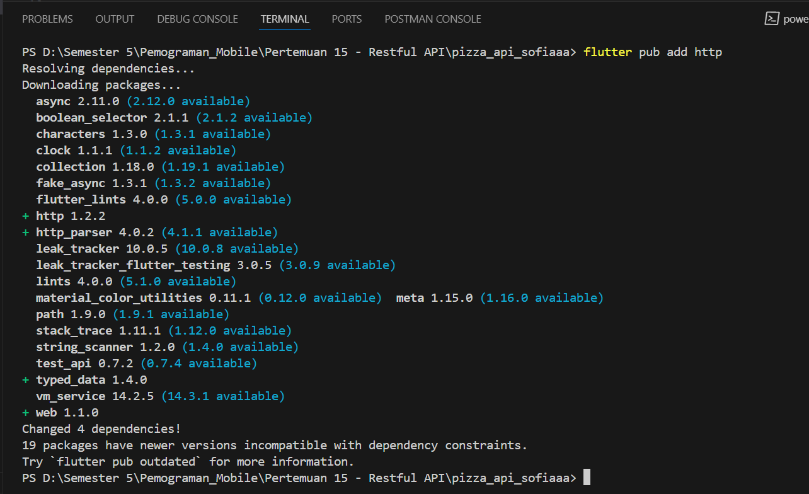
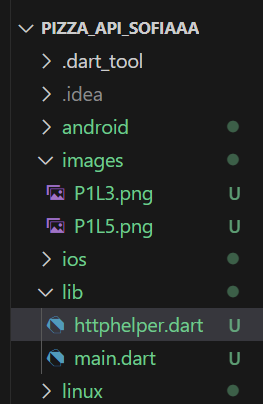
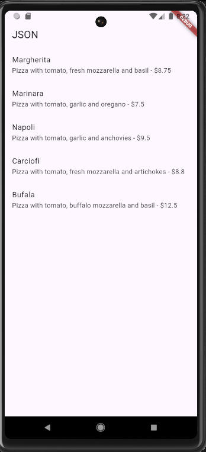
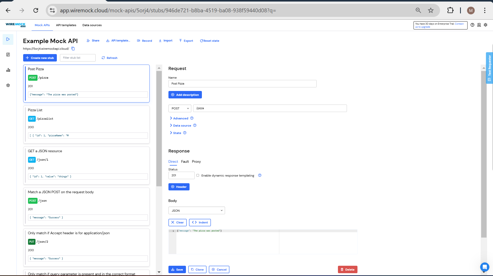
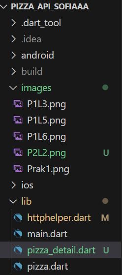
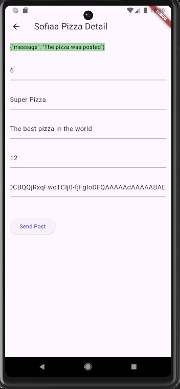

# Jobsheet 14 - Restful API            
Nama    : Masyithah Sophia Damayanti        
Kelas   : TI-3C         
No      : 15            
NIM     : 2241720011        

## Praktikum 1, Designing an HTTP client and getting data       

### Mendaftarlah ke layanan Lab Mock di https://app.wiremock.cloud/. Bisa anda gunakan akun google untuk mendaftar. Jika berhasil bendaftar dan login, akan muncul seperti gambar berikut.                  

### Di halaman dahsboard, klik menu Stubs, kemudian klik entri pertama yaitu “GET a JSON resource”. Anda akan melihat layar yang mirip dengan berikut.      

### Klik “Create new stub”. Di kolom sebelah kanan, lengkapi data berikut. Namanya adalah “Pizza List”, kemudian pilih GET dan isi dengan “/pizzalist”. Kemudian, pada bagian Response, untuk status 200, kemudian pada Body pilih JSON sebagai formatnya dan isi konten JSON dari https://bit.ly/pizzalist. Perhatikan gambar berikut.             
Hasil:                  
              

### Tekan tombol SAVE di bagian bawah halaman untuk menyimpan Mock ini. Jika berhasil tersimpan, maka Mock API sudah siap digunakan.        

### Buatlah project flutter baru dengan nama pizza_api_nama_anda, tambahkan depedensi “http” melalui terminal.      
Hasil: 
        

### DI folder “lib” project anda, tambahkan file dengan nama “httphelper.dart”.         
Hasil:                 
            

### Isi httphelper.dart dengan kode berikut. Ubah “02z2g.mocklab.io” dengan URL Mock API anda.      
``` dart        
import 'dart:io';
import 'package:http/http.dart' as http;
import 'dart:convert';    
import 'pizza.dart';   

class HttpHelper {
  final String authority = '5orj4.wiremockapi.cloud'; 
  final String path = 'pizzalist';

  Future<List<Pizza>> getPizzaList() async {
    final Uri url = Uri.https(authority, path); 
    final http.Response result = await http.get(url);
    
    if (result.statusCode == HttpStatus.ok) {
      final jsonResponse = jsonDecode(result.body) as List;
      
      List<Pizza> pizzas = jsonResponse.map<Pizza>((i) =>
        Pizza.fromJson(i)).toList();
      return pizzas;
    } else {
      return [];
    }
  }
}

```     
### Di file “main.dart”, di class _ MyHomePageState, tambahkan metode bernama “callPizzas”. Metode ini mengembalikan sebuah Future dari daftar objek Pizza dengan memanggil metode getPizzaList dari kelas HttpHelper, dengan kode sebagai berikut:     
``` dart        
Future<List<Pizza>> callPizzas() async {
    HttpHelper helper = HttpHelper();
    return await helper.getPizzaList();
  }     
```     

### Pada metode build di class _MyHomePageState, di dalam body Scaffold, tambahkan FutureBuilder yang membuat ListView dari widget ListTile yang berisi objek Pizza:        
``` dart        
 @override
  Widget build(BuildContext context) {
    return Scaffold(
      appBar: AppBar(title: const Text('JSON')),
      body: FutureBuilder<List<Pizza>>(
        future: callPizzas(),
        builder: (BuildContext context, AsyncSnapshot<List<Pizza>> snapshot) {
          if (snapshot.hasError) {
            return const Center(
              child: Text('Something went wrong'),
            );
          }

          if (snapshot.connectionState == ConnectionState.waiting) {
            return const Center(
              child: CircularProgressIndicator(),
            );
          }

          if (!snapshot.hasData || snapshot.data!.isEmpty) {
            return const Center(
              child: Text('No data available'),
            );
          }

          return ListView.builder(
            itemCount: snapshot.data!.length,
            itemBuilder: (BuildContext context, int position) {
              return ListTile(
                title: Text(snapshot.data![position].pizzaName),
                subtitle: Text(
                  '${snapshot.data![position].description} - \$${snapshot.data![position].price.toString()}',
                ),
              );
            },
          );
        },
      ),
    );
  }
```     
### Jalankan aplikasi. Anda akan melihat layar yang mirip dengan berikut ini:       
           

## Praktikum 2. POST-ing data       
### Masuk ke layanan Lab Mock di https://app.wiremock.cloud/ dan klik bagian Stubs, kemudian, buatlah stub baru.                    

### Lengkapi isian seperti gambar berikut:      

### Simpan.     
Hasil:      
        

### Di proyek Flutter, di file httpHelper.dart, di kelas HttpHelper, buat metode baru bernama postPizza, lengkapi kode sebagai berikut.
``` dart        
Future<String> postPizza (Pizza pizza) async {
    const postPath = '/pizza';
    String post = json.encode(pizza.toJson());
    Uri url = Uri.https(authority, postPath);
    http.Response r = await http.post(
      url,
      body: post,
    );
    return r.body;
  }
```     
### Di dalam proyek, buat sebuah file baru bernama pizza_detail.dart.       
        

### Di bagian atas file baru, tambahkan impor yang diperlukan.      
``` dart        
import 'package:flutter/material.dart';
import 'pizza.dart';
import 'httphelper.dart';
```     

### Buat StatefulWidget bernama PizzaDetailScreen.
``` dart        
class PizzaDetailScreen extends StatefulWidget {
  const PizzaDetailScreen({super.key});

  @override
  State<PizzaDetailScreen> createState() => _PizzaDetailScreenState();
}

class _PizzaDetailScreenState extends State<PizzaDetailScreen> {
  @override
  Widget build(BuildContext context) {
    return const Placeholder();
  }
}
```     

### Di bagian atas kelas _PizzaDetailScreenState, tambahkan lima widget TextEditingController. Widget ini akan berisi data untuk objek Pizza yang akan diposting nanti. Juga, tambahkan sebuah String yang akan berisi hasil dari permintaan POST.          
``` dart        
final TextEditingController txtId = TextEditingController();
final TextEditingController txtName = TextEditingController();
final TextEditingController txtDescription =
TextEditingController();
final TextEditingController txtPrice = TextEditingController();
final TextEditingController txtImageUrl =
TextEditingController();
String operatiationResult ='';
```     

### Override metode dispose() untuk membuang controllers        
``` dart        
@override
  void dispose() {
    txtId.dispose();
    txtName.dispose();
    txtDescription.dispose();
    txtPrice.dispose();
    txtImageUrl.dispose();
    super.dispose();
  }
```         

### Dalam metode build() pada kelas, kita return sebuah Scaffold, yang AppBar-nya berisi Teks yang menyatakan “Detail Pizza” dan Body-nya berisi Padding dan SingleChildScrollView yang berisi Column.      
``` dart        
@override
  Widget build(BuildContext context) {
    return Scaffold(
      appBar: AppBar(
        title: const Text('Sofiaa Pizza Detail'),
      ),
      body: Padding(
        padding: const EdgeInsets.all(12.0),
        child: SingleChildScrollView(
          child: Column(
            children: [
            ],
          ),
        ),
      ),
    );
  }
```     

### Untuk properti anak dari Column, tambahkan beberapa Text yang akan berisi hasil posting, lima TextFields, masing-masing terikat pada TextEditingController, dan sebuah ElevatedButton untuk menyelesaikan aksi POST (metode postPizza akan dibuat berikutnya). Juga, tambahkan SizedBox untuk memberi jarak pada widget di layar.       
``` dart        
Text(
                operationResult,
                style: TextStyle(
                  backgroundColor: Colors.green[200],
                  color: Colors.black,
                ),
              ),
              const SizedBox(
                height: 24,
              ),
              TextField(
                controller: txtId,
                decoration: const InputDecoration(hintText: 'Insert ID') 
              ),
              const SizedBox(
                height: 24,
              ),
              TextField(
                controller: txtId,
                decoration: const InputDecoration(hintText: 'Insert Pizza Name') 
              ),
              const SizedBox(
                height: 24,
              ),
              TextField(
                controller: txtId,
                decoration: const InputDecoration(hintText: 'Insert Description') 
              ),
              const SizedBox(
                height: 24,
              ),
              TextField(
                controller: txtId,
                decoration: const InputDecoration(hintText: 'Insert Price') 
              ),
              const SizedBox(
                height: 24,
              ),
              TextField(
                controller: txtId,
                decoration: const InputDecoration(hintText: 'Insert Image Url') 
              ),
              const SizedBox(
                height: 48,
              ),
              ElevatedButton(
                child: const Text('Send Post'),
                onPressed:(){
                  postPizza();
                }
              ),
```     

### Di bagian bawah kelas _PizzaDetailState, tambahkan metode postPizza.        
``` dart        
Future<void> postPizza() async {
    HttpHelper helper = HttpHelper();
    Pizza pizza = Pizza(
      id: int.tryParse(txtId.text) ?? 0, // Gunakan default value jika null
      pizzaName: txtName.text,
      description: txtDescription.text,
      price: double.tryParse(txtPrice.text) ??
          0.0, // Gunakan default value jika null
      imageUrl: txtImageUrl.text,
    );

    String result = await helper.postPizza(pizza);

    setState(() {
      operationResult = result;
    });
  }
```     

### Di file main.dart, impor file pizza_detail.dart.        

### Di perancah metode build() dari kelas _MyHomePageState, tambahkan FloatingActionButton yang akan menavigasi ke rute PizzaDetail.        
``` dart        
floatingActionButton: FloatingActionButton(
          child: const Icon(Icons.add),
          onPressed: () {
            Navigator.push(
              context,
              MaterialPageRoute(
                  builder: (context) => const PizzaDetailScreen()),
            );
          }),
```

### Tambahkan detail pizza di kolom teks dan tekan tombol Kirim Postingan. Anda akan melihat hasil yang berhasil, seperti yang ditunjukkan pada gambar berikut.          
       
   

