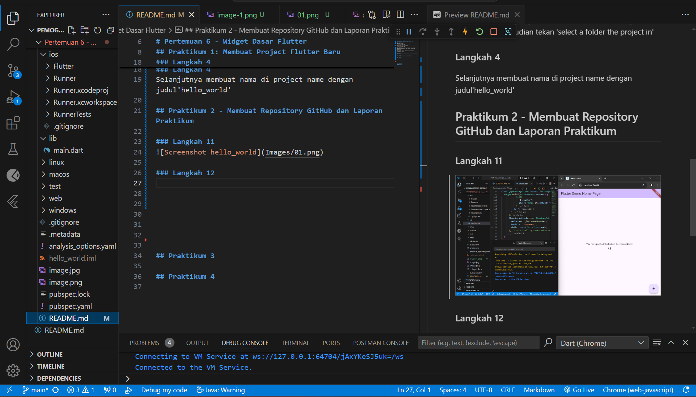
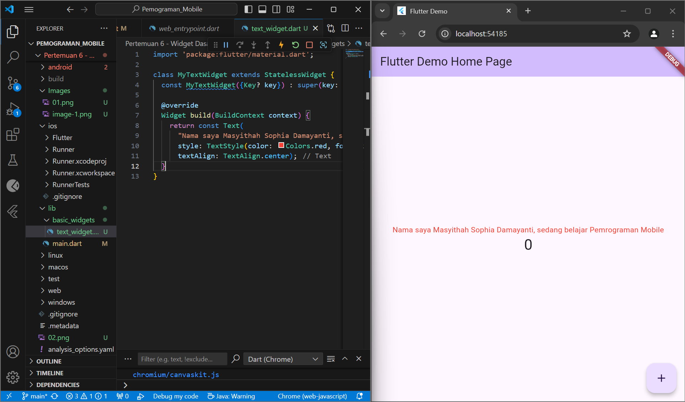
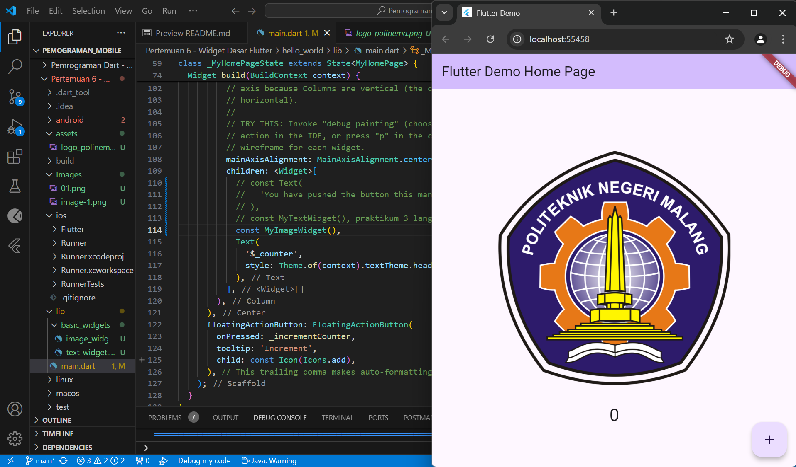
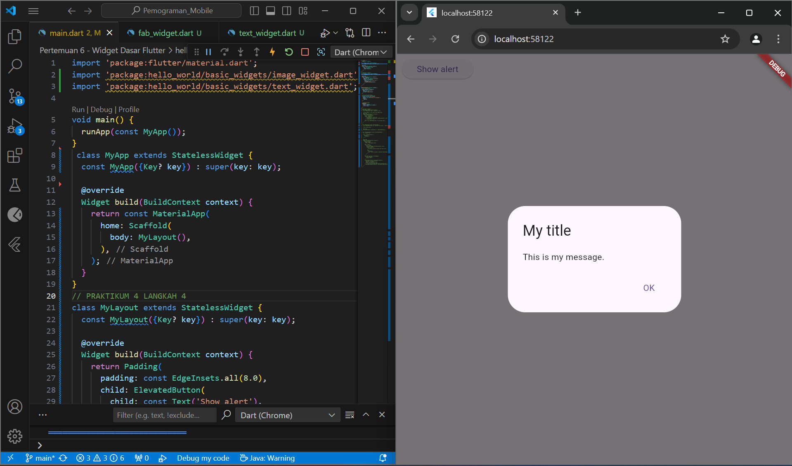
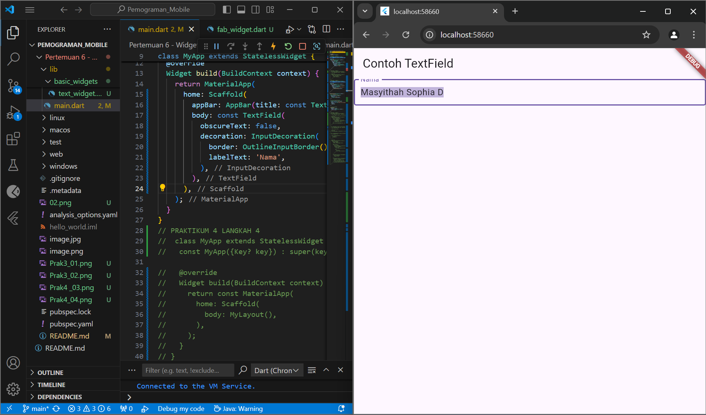
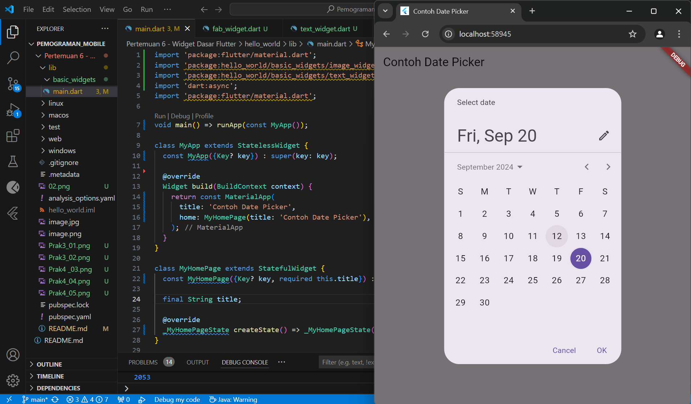

Nama        : Masyithah Sophia Damayanti        
Kelas       : TI-3C / 15        
NIM         : 2241720011        

# Pertemuan 6 - Widget Dasar Flutter 

## Praktikum 1: Membuat Project Flutter Baru
### Langkah 1 
Pilih New Project
      
### Langkah 2
Selanjutnya Pilih Application    
      
### Langkah 3 
Buat nama folder yang bernama Pertemuan 6 - Widget Dasar Flutter kemudian tekan 'select a folder the project in' 
### Langkah 4
Selanjutnya membuat nama di project name dengan judul'hello_world'       

## Praktikum 2 - Membuat Repository GitHub dan Laporan Praktikum            
### Langkah 11
        
### Langkah 12      
        

## Praktikum 3 - Menerapkan Widget Dasar               
### Langkah 1 - Text Widget         
      
### Langkah 2 - Image Widget        

## Praktikum 4 - Menerapkan Widget Material Design dan iOS Cupertino        
### Langkah 3 - Scaffold Widget     

### Langkah 4 - Dialog Widget       

### Langkah 5 - Input dan Selection Widget              

### Langkah 6 - Date and Time Pickers

