Nama        : Masyithah Sophia Damayanti        
Kelas       : TI-3C / 15        
NIM         : 2241720011        

# Pertemuan 6 - Widget Dasar Flutter 

## Praktikum 1: Membuat Project Flutter Baru
### Langkah 1 
Pilih New Project
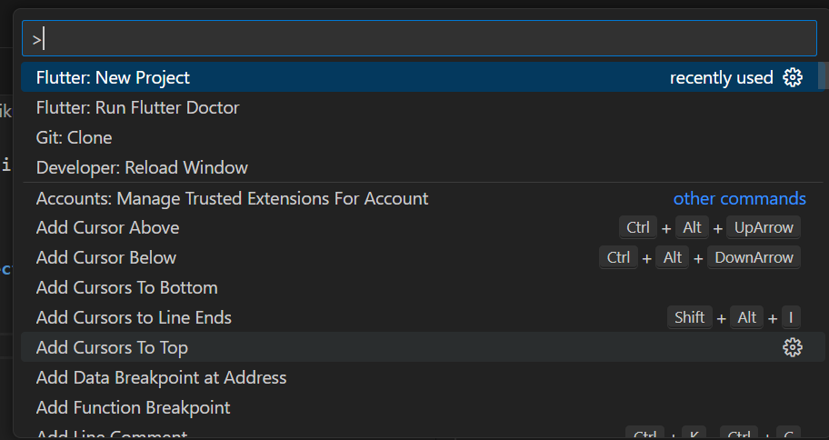      
### Langkah 2
Selanjutnya Pilih Application    
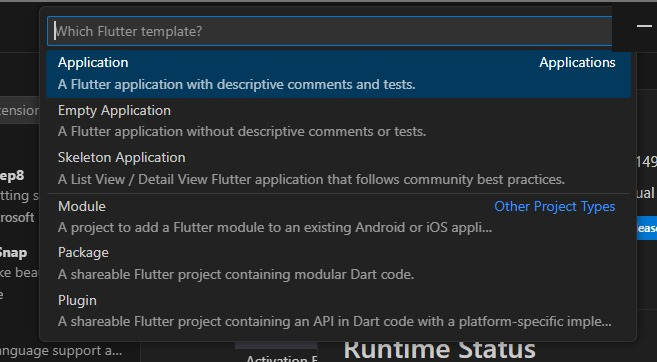      
### Langkah 3 
Buat nama folder yang bernama Pertemuan 6 - Widget Dasar Flutter kemudian tekan 'select a folder the project in' 
### Langkah 4
Selanjutnya membuat nama di project name dengan judul'hello_world'       

## Praktikum 2 - Membuat Repository GitHub dan Laporan Praktikum            
### Langkah 11
Menampilkan Halaman Aplikasi dengan Judul 'Flutter Demo Home Page' dan juga terdapat float button yang bisa menambah saat di klik buttonnya.
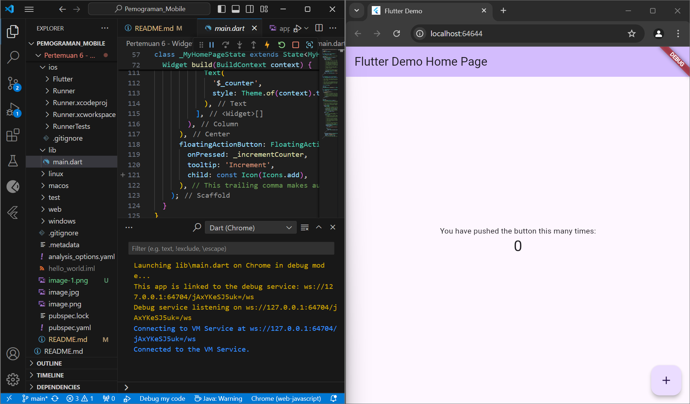        
### Langkah 12      
Menampilkan file di readme dan preview.     
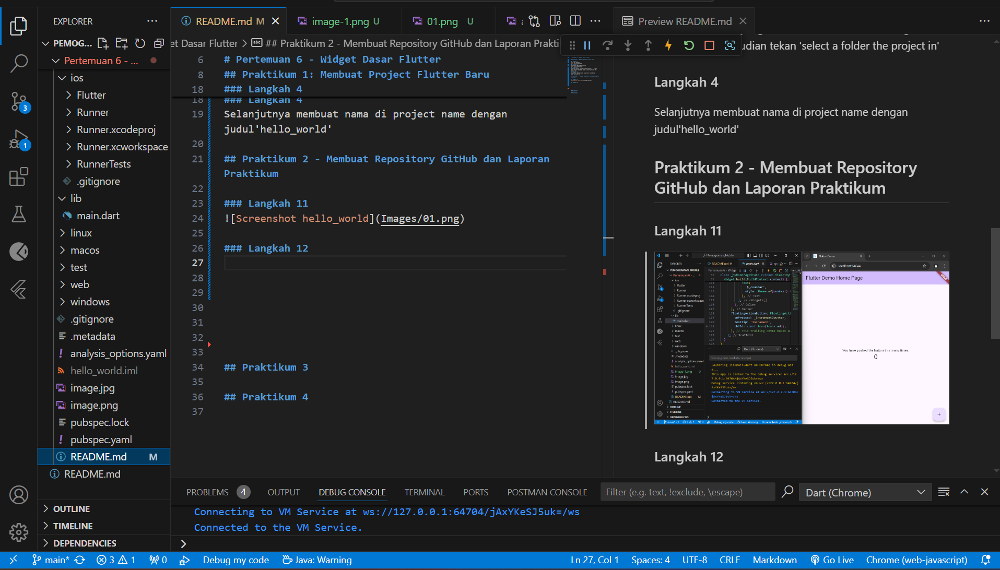        

## Praktikum 3 - Menerapkan Widget Dasar               
### Langkah 1 - Text Widget         
Kode diatas mendefinisikan sebuah widget yang bernama'MyTextWidget' dengan memunculkan hasil 'Nama saya Masyithah Sophia Damayanti,sedang belajar Pemograman Mobile' dengan font teks berwarna merah, ukuran font 14, dan teks diatur rata tengah (TextAlign.center).
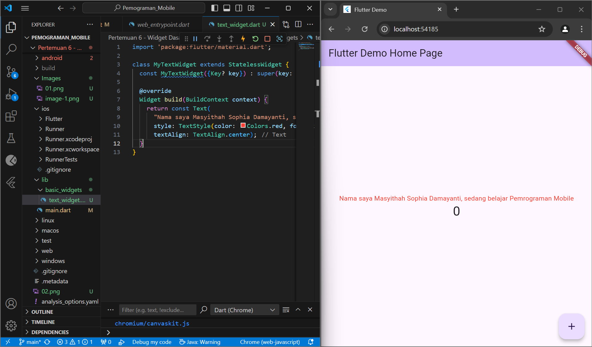      
### Langkah 2 - Image Widget        
Kode tersebut membuat widget 'MyImageWidget' untuk menampilkan gambar logo_polinema.jpg dari aset lokal, yang harus dideklarasikan di file pubspec.yaml.   
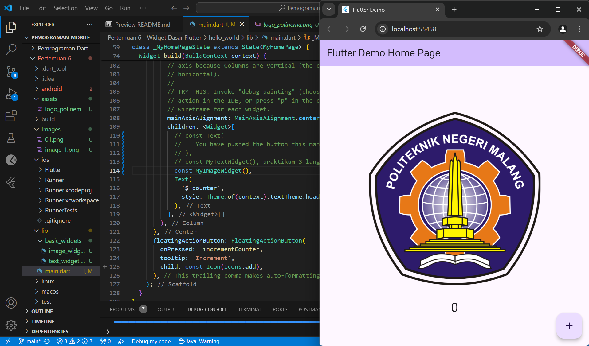

## Praktikum 4 - Menerapkan Widget Material Design dan iOS Cupertino        
### Langkah 3 - Scaffold Widget         
Kode untuk membuat aplikasi Flutter dengan tombol yang menambah angka setiap kali ditekan, menampilkan hasilnya di tengah layar, menggunakan setState() untuk memperbarui tampilan.    

### Langkah 4 - Dialog Widget           
Kode diatas menampilkan aplikasi Flutter dengan tombol yang, ketika ditekan, akan menampilkan dialog peringatan berjudul "My title" dan pesan "This is my message." Dialog ini juga memiliki tombol "OK" untuk menutupnya.
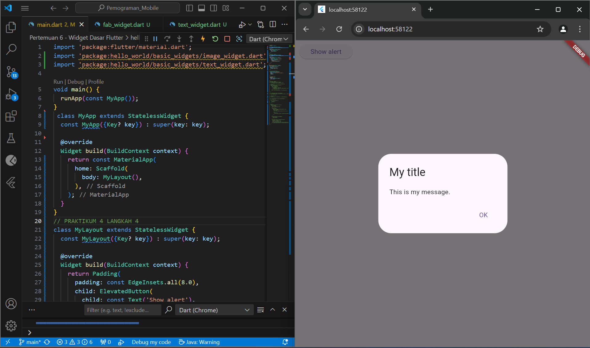
### Langkah 5 - Input dan Selection Widget          
Kode tersebut menampilkan Text Field untuk memasukkan nama 'Masyithah Sophia Damayanti'.
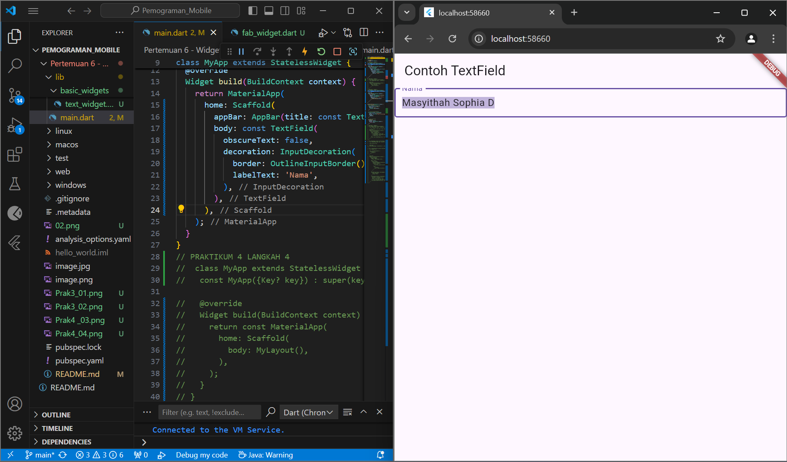
### Langkah 6 - Date and Time Pickers       
Kode menampilkan input dan selection widget berupa Date and Time Pickers
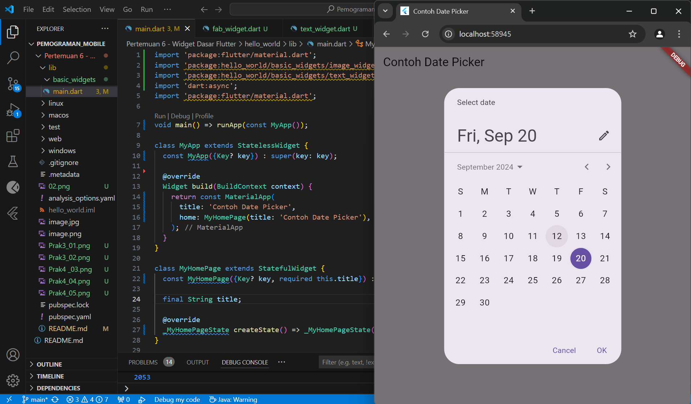     

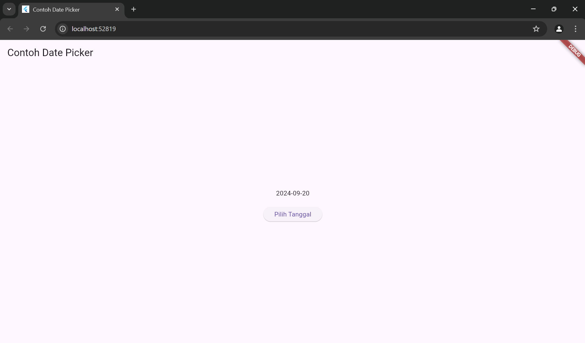         

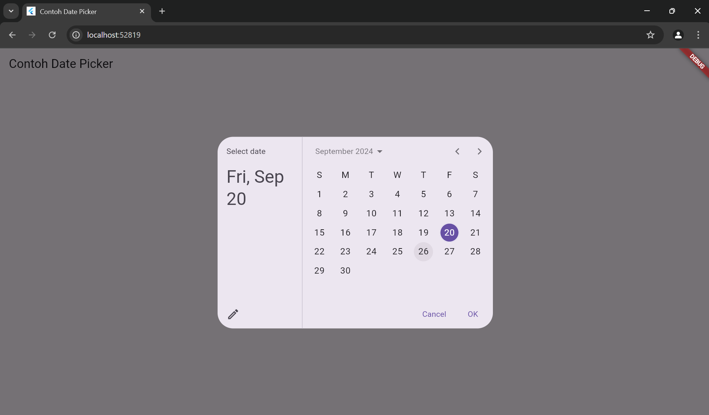

