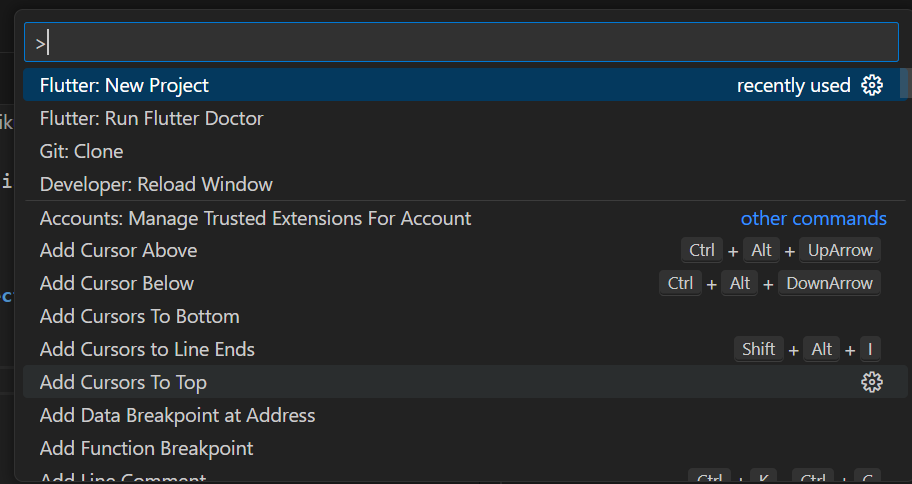
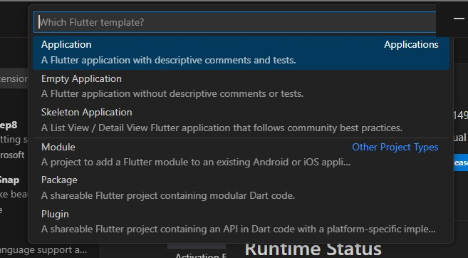

Nama        : Masyithah Sophia Damayanti        
Kelas       : TI-3C / 15        
NIM         : 2241720011        

# Praktikum 1: Membuat Project Flutter Baru 

## Langkah 1
1. Pilih New Project
      
2. Selanjutnya Pilih Application       
      
3. Buat nama folder yang bernama Pertemuan 6 - Widget Dasar Flutter kemudian tekan 'select a folder the project in' 
4. 

## Praktikum 2      

## Praktikum 3      

## Praktikum 4
