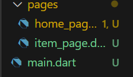
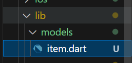
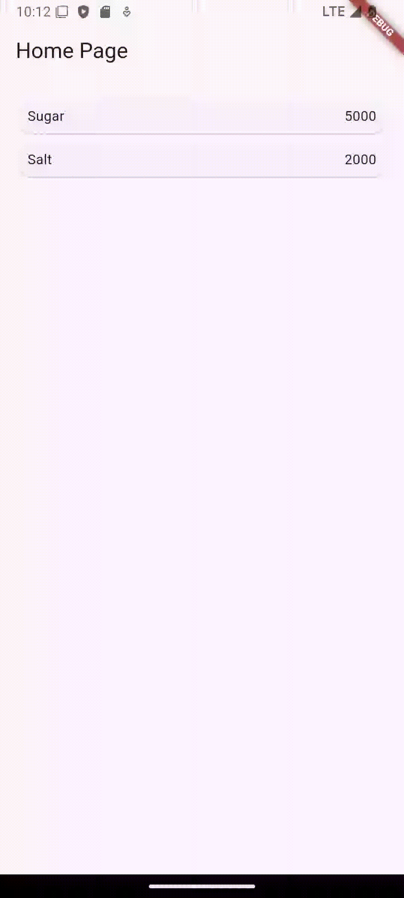

Nama    : Masyithah Sophia Damayanti        
Kelas   : TI - 3C       
NIM     : 2241720011        
No      : 15

# Pertemuan 6 Layout dan Navigasi       
## Praktikum 5 - Membangun Navigasi di Flutter      

### Langkah 1: Siapkan project baru         
      

### Langkah 2: Mendefinisikan Route         
Membuat Folder Baru di dalam Lib        
     
Selanjutnya, membuat 2 file yang bernama 'home_page.dart' dan 'item_page.dart' di dalam folder pages  
Kode Program 'home_page.dart':      
``` dart  
import 'package:flutter/material.dart';
import 'package:belanja/models/item.dart';

class HomePage extends StatelessWidget {
  @override
  Widget build(BuildContext context) {
    //TODO: implement build
    throw UnimplementedError();
  }
}       
```     
Kode Program 'item_page.dart':      
``` dart        
import 'package:flutter/material.dart';

class ItemPage extends StatelessWidget {
  const ItemPage({super.key});

  @override
  Widget build(BuildContext context) {
    //TODO: implement build
    throw UnimplementedError();
  }
}       
```     
### Langkah 3: Lengkapi Kode di main.dart       
``` dart        
import 'package:flutter/material.dart';
import 'package:belanja/pages/home_page.dart';
import 'package:belanja/pages/item_page.dart';

void main() {
  runApp(MaterialApp(
    initialRoute: '/',
    routes: {
      '/': (context) => HomePage(),
      '/item': (context) => const ItemPage(),
    },
  ));
}       
```     
### Langkah 4: Membuat data model       
Membuat Folder dengan nama'models' dan letakkan di lib, selnajutnya membuat file dengan nama 'item.dart'
             
Kode Program 'item.dart':
``` dart        
class Item {
  String name;
  int price;

  Item({required this.name, required this.price});
}       
```         
### Langkah 5: lengkapi kode di class HomePage          
``` dart
class HomePage extends StatelessWidget {
  final List<Item> items = [
    Item(name: 'Sugar', price: 5000),
    Item(name: 'Salt', price: 2000),
  ];
}
```
### Langkah 6: Membuat ListView dan itemBuilder     
Menambhakan kode program di 'home_page.dart'
``` dart
@override
  Widget build(BuildContext context) {
    return Scaffold(
      appBar: AppBar(
        title: const Text('Home Page'),
      ),
      body: Container(
        margin: const EdgeInsets.all(8),
        child: ListView.builder(
          padding: const EdgeInsets.all(8),
          itemCount: items.length,
          itemBuilder: (context, index) {
            final item = items[index];
            return Card(
              child: Container(
                margin: const EdgeInsets.all(8),
                child: Row(
                  children: [
                    Expanded(child: Text(item.name)),
                    Expanded(
                      child: Text(
                        item.price.toString(),
                        textAlign: TextAlign.end,
                      ),
                    ),
                  ],
                ),
              ),
            );
          },
        ),
      ),
    );
  }     
```     
## Hasil aplikasi pada emulator atau pada device:       
              
### Langkah 7: Menambahkan aksi pada ListView   
Menambahkan Kode program 'home_page.dart':      
``` dart  
import 'package:flutter/material.dart';
import 'package:belanja/models/item.dart';
import 'package:belanja/pages/item_page.dart';

class HomePage extends StatelessWidget {
  final List<Item> items = [
    Item(name: 'Sugar', price: 5000),
    Item(name: 'Salt', price: 2000),
  ];

  @override
  Widget build(BuildContext context) {
    return Scaffold(
      appBar: AppBar(
        title: const Text('Home Page'),
      ),
      body: Container(
        margin: const EdgeInsets.all(8),
        child: ListView.builder(
          padding: const EdgeInsets.all(8),
          itemCount: items.length,
          itemBuilder: (context, index) {
            final item = items[index];
            return InkWell(
              onTap: () {
                Navigator.push(
                  context,
                  MaterialPageRoute(
                    builder: (context) => ItemPage(item: item), // Kirim item yang dipilih ke ItemPage
                  ),
                );
              },
              child: Card(
                child: Container(
                  margin: const EdgeInsets.all(8),
                  child: Row(
                    children: [
                      Expanded(child: Text(item.name)),
                      Expanded(
                        child: Text(
                          item.price.toString(),
                          textAlign: TextAlign.end,
                        ),
                      ),
                    ],
                  ),
                ),
              ),
            );
          },
        ),
      ),
    );
  }
}       
```
Tambahkan Kode Program 'item_page.dart':        
``` dart
import 'package:flutter/material.dart';
import 'package:belanja/models/item.dart';

class ItemPage extends StatelessWidget {
  final Item item; // Menerima data item

  const ItemPage({super.key, required this.item});

  @override
  Widget build(BuildContext context) {
    return Scaffold(
      appBar: AppBar(
        title: Text(item.name), // Menampilkan nama item di AppBar
      ),
      body: Center(
        child: Card(
          margin: const EdgeInsets.all(16.0),
          elevation: 5, // Memberikan efek bayangan pada card
          shape: RoundedRectangleBorder(
            borderRadius: BorderRadius.circular(15),
          ),
          child: Padding(
            padding: const EdgeInsets.all(20.0),
            child: Column(
              mainAxisSize: MainAxisSize.min, // Agar ukuran kolom menyesuaikan konten
              crossAxisAlignment: CrossAxisAlignment.center, // Posisikan di tengah
              children: [
                Text(
                  item.name,
                  style: const TextStyle(
                    fontSize: 28,
                    fontWeight: FontWeight.bold,
                    color: Colors.blue,
                  ),
                  textAlign: TextAlign.center, // Teks di tengah
                ),
                const SizedBox(height: 16), // Jarak antar elemen
                Text(
                  'Price: \$${item.price}',
                  style: const TextStyle(
                    fontSize: 24,
                    color: Colors.grey,
                  ),
                  textAlign: TextAlign.center,
                ),
                const SizedBox(height: 20),
                ElevatedButton(
                  onPressed: () {
                    Navigator.pop(context); // Kembali ke halaman sebelumnya
                  },
                  child: const Text('Back'),
                  style: ElevatedButton.styleFrom(
                    padding: const EdgeInsets.symmetric(horizontal: 24, vertical: 12),
                    textStyle: const TextStyle(fontSize: 18),
                  ),
                ),
              ],
            ),
          ),
        ),
      ),
    );
  }
}
```     
Tambahkan Kode Program 'main.dart':     
``` dart
import 'package:flutter/material.dart';
import 'package:belanja/pages/home_page.dart';

void main() {
  runApp(MaterialApp(
    initialRoute: '/',
    routes: {
      '/': (context) => HomePage(),
    },
  ));
}
```     
## Hasil menambahkan aksi pada ListView
      

## Tugas Praktikum 2        
Kode program 'main.dart':   
``` dart   
import 'package:flutter/material.dart';
import 'package:belanja/pages/home_page.dart';
import 'package:belanja/pages/item_page.dart';

void main() {
  //runApp(const MyApp());
  runApp(MaterialApp(
    initialRoute: '/',
    routes: {
      '/': (context) => HomePage(),
      '/item': (context) => const ItemPage(),
    },
  ));
}

class MyApp extends StatelessWidget {
  const MyApp({super.key});

  // This widget is the root of your application.
  @override
  Widget build(BuildContext context) {
    return MaterialApp(
      title: 'Flutter Demo',
      theme: ThemeData(
        colorScheme: ColorScheme.fromSeed(seedColor: Colors.deepPurple),
        useMaterial3: true,
      ),
      home: const MyHomePage(title: 'Flutter Demo Home Page'),
    );
  }
}

class MyHomePage extends StatefulWidget {
  const MyHomePage({super.key, required this.title});

  // This widget is the home page of your application. It is stateful, meaning
  // that it has a State object (defined below) that contains fields that affect
  // how it looks.

  // This class is the configuration for the state. It holds the values (in this
  // case the title) provided by the parent (in this case the App widget) and
  // used by the build method of the State. Fields in a Widget subclass are
  // always marked "final".

  final String title;

  @override
  State<MyHomePage> createState() => _MyHomePageState();
}

class _MyHomePageState extends State<MyHomePage> {
  int _counter = 0;

  void _incrementCounter() {
    setState(() {
      // This call to setState tells the Flutter framework that something has
      // changed in this State, which causes it to rerun the build method below
      // so that the display can reflect the updated values. If we changed
      // _counter without calling setState(), then the build method would not be
      // called again, and so nothing would appear to happen.
      _counter++;
    });
  }

  @override
  Widget build(BuildContext context) {
    // This method is rerun every time setState is called, for instance as done
    // by the _incrementCounter method above.
    //
    // The Flutter framework has been optimized to make rerunning build methods
    // fast, so that you can just rebuild anything that needs updating rather
    // than having to individually change instances of widgets.
    return Scaffold(
      appBar: AppBar(
        // TRY THIS: Try changing the color here to a specific color (to
        // Colors.amber, perhaps?) and trigger a hot reload to see the AppBar
        // change color while the other colors stay the same.
        backgroundColor: Theme.of(context).colorScheme.inversePrimary,
        // Here we take the value from the MyHomePage object that was created by
        // the App.build method, and use it to set our appbar title.
        title: Text(widget.title),
      ),
      body: Center(
        // Center is a layout widget. It takes a single child and positions it
        // in the middle of the parent.
        child: Column(
          // Column is also a layout widget. It takes a list of children and
          // arranges them vertically. By default, it sizes itself to fit its
          // children horizontally, and tries to be as tall as its parent.
          //
          // Column has various properties to control how it sizes itself and
          // how it positions its children. Here we use mainAxisAlignment to
          // center the children vertically; the main axis here is the vertical
          // axis because Columns are vertical (the cross axis would be
          // horizontal).
          //
          // TRY THIS: Invoke "debug painting" (choose the "Toggle Debug Paint"
          // action in the IDE, or press "p" in the console), to see the
          // wireframe for each widget.
          mainAxisAlignment: MainAxisAlignment.center,
          children: <Widget>[
            const Text(
              'You have pushed the button this many times:',
            ),
            Text(
              '$_counter',
              style: Theme.of(context).textTheme.headlineMedium,
            ),
          ],
        ),
      ),
      floatingActionButton: FloatingActionButton(
        onPressed: _incrementCounter,
        tooltip: 'Increment',
        child: const Icon(Icons.add),
      ), // This trailing comma makes auto-formatting nicer for build methods.
    );
  }
} 
```   
Kode Program 'item.dart'    
``` dart    
class Item {
  String name;
  int price;
  String img;
  int stock;
  int rating;
  String author;
  String ukuran ;
  String update;

  Item({
    required this.name, 
    required this.price,
    required this.img,
    required this.stock,
    required this.rating,
    required this.author,
    required this.ukuran,
    required this.update,
    });
}
```   
Kode Program 'home_page.dart':    
``` dart    
import 'package:flutter/material.dart';
import 'package:belanja/models/item.dart';

class HomePage extends StatelessWidget {
  final List<Item> items = [
    Item(
      name: 'Grey Cargo Jean Mid Rise',
      price: 250000,
      img: 'assets/jeans.jpeg',
      stock: 5,
      rating: 4,
      author: 'Jeans',
      ukuran: 'XS, S, L, M, XL, XXL, LLL',
      update: 'June 2024',
    ),
    Item(
      name: 'Casual Shirt',
      price: 90000,
      img: 'assets/kemeja.jpeg',
      stock: 10,
      rating: 3,
      author: 'cotton',
      ukuran: 'XS, S, L, M, XL, XXL, LLL',
      update: 'January 2024',
    ),
    Item(
      name: 'Paris Dress',
      price: 345000,
      img: 'assets/dress.jpeg',
      stock: 15,
      rating: 5,
      author: 'cotton',
      ukuran: 'All Size',
      update: 'New Arrival',
    ),
    Item(
      name: 'Chalk Stiletto Heels',
      price: 540000,
      img: 'assets/heels.jpeg',
      stock: 25,
      rating: 5,
      author: 'classic pumps',
      ukuran: '36, 37, 38, 39, 40',
      update: 'September 2024',
    ),
    Item(
      name: 'New Balance 530',
      price: 785000,
      img: 'assets/sepatu.jpeg',
      stock: 25,
      rating: 3,
      author: 'Pig Skin',
      ukuran: '38, 39, 41',
      update: 'May 2024',
    ),
  ];

  HomePage({super.key});

  @override
  Widget build(BuildContext context) {
    // Mendapatkan ukuran layar
    var screenWidth = MediaQuery.of(context).size.width;

    // Tentukan jumlah kolom berdasarkan lebar layar
    int crossAxisCount = screenWidth > 600 ? 3 : 2;

    return Scaffold(
      appBar: AppBar(
        title: const Text('Ciwi Fashion'),
        backgroundColor: const Color.fromARGB(255, 228, 124, 179),
      ),
      bottomNavigationBar: BottomAppBar(
        color: const Color.fromARGB(255, 228, 124, 179),
        height: 45,
        child: const Row(
          children: [
            Padding(padding: EdgeInsets.all(8.0)),
            Text(
            'Masyithah Sophia D                                 2241720011',
              style: TextStyle(
                fontWeight: FontWeight.w500,
                color: Colors.white,
              ),
              textAlign: TextAlign.left,
            ),
          ],
        ),
      ),
      body: Container(
        margin: const EdgeInsets.all(8),
        child: GridView.builder(
          gridDelegate: SliverGridDelegateWithFixedCrossAxisCount(
            crossAxisCount: crossAxisCount, // Jumlah kolom disesuaikan
            crossAxisSpacing: 16.0, // Tambahkan jarak antara kolom
            mainAxisSpacing: 16.0,  // Tambahkan jarak antara baris
            childAspectRatio: 0.65,  // Mengatur proporsi tampilan item
          ),
          itemCount: items.length,
          itemBuilder: (context, index) {
            final item = items[index];
            return InkWell(
              onTap: () {
                Navigator.pushNamed(context, '/item', arguments: item);
              },
              child: Card(
                elevation: 4,
                shape: RoundedRectangleBorder(
                  borderRadius: BorderRadius.circular(16),
                ),
                child: Container(
                  padding: const EdgeInsets.all(12),
                  decoration: BoxDecoration(
                    borderRadius: BorderRadius.circular(16),
                    color: Colors.white,
                    boxShadow: [
                      BoxShadow(
                        color: Colors.grey.withOpacity(0.2),
                        spreadRadius: 1,
                        blurRadius: 8,
                        offset: const Offset(0, 4),
                      ),
                    ],
                  ),
                  child: Column(
                    crossAxisAlignment: CrossAxisAlignment.start,
                    children: [
                      Expanded(
                        child: Center(
                          child: Hero(
                            tag: item.img.toString(),
                            child: ClipRRect(
                              borderRadius: BorderRadius.circular(8),
                              child: Image.asset(
                                item.img.toString(),
                                fit: BoxFit.cover,
                              ),
                            ),
                          ),
                        ),
                      ),
                      const SizedBox(height: 8),
                      Text(
                        item.name,
                        style: const TextStyle(
                          fontWeight: FontWeight.bold,
                          fontSize: 16,
                        ),
                        textAlign: TextAlign.center,
                      ),
                      const SizedBox(height: 4),
                      Text(
                        ' ${item.author}',
                        style: TextStyle(
                          fontSize: 12,
                          color: Colors.grey.shade600,
                        ),
                      ),
                      const SizedBox(height: 8),
                      Row(
                        mainAxisAlignment: MainAxisAlignment.spaceBetween,
                        children: [
                          Text(
                            'Rp${item.price.toString()},00',
                            style: const TextStyle(
                              fontSize: 14,
                              fontWeight: FontWeight.bold,
                              color: const Color.fromARGB(255, 228, 124, 179),
                            ),
                          ),
                          Text(
                            'Stock: ${item.stock.toString()}',
                            style: const TextStyle(
                              fontSize: 12,
                              color: Colors.black,
                            ),
                          ),
                        ],
                      ),
                      const SizedBox(height: 8),
                      Row(
                        children: List.generate(5, (i) {
                          return Icon(
                            Icons.star,
                            size: 16,
                            color: i < item.rating ? Colors.yellow : Colors.grey.shade300,
                          );
                        }),
                      ),
                    ],
                  ),
                ),
              ),
            );
          },
        ),
      ),
    );
  }
}   
```   
Kode Program 'item_page.dart':    
``` dart
import 'package:flutter/material.dart';
import 'package:belanja/models/item.dart';

class ItemPage extends StatelessWidget {
  const ItemPage({super.key});

  @override
  Widget build(BuildContext context) {
    final Item item = ModalRoute.of(context)!.settings.arguments as Item;

    return Scaffold(
      appBar: AppBar(
        title: Text(item.name),
        backgroundColor: const Color.fromARGB(255, 228, 124, 179),
      ),
      body: GestureDetector(
        onTap: () {
          Navigator.pop(context);
        },
        child: SingleChildScrollView(
          // Tambahkan SingleChildScrollView agar bisa di scroll
          child: Card(
            child: Column(
              children: [
                Container(
                  margin: const EdgeInsets.all(8.0),
                  child: Row(
                    crossAxisAlignment: CrossAxisAlignment.start,
                    children: [
                      SizedBox(
                        width: 200,
                        child: Column(
                          children: [
                            Align(
                              alignment: Alignment.centerLeft,
                              child: Hero(
                                tag: item.img.toString(),
                                child: Image.asset(
                                  item.img.toString(),
                                  width: 200,
                                  height: 300,
                                ),
                              ),
                            ),
                          ],
                        ),
                      ),
                      Flexible(
                        child: Container(
                          padding: const EdgeInsets.only(left: 30),
                          child: Column(
                            crossAxisAlignment: CrossAxisAlignment.start,
                            children: [
                              Text(
                                item.name,
                                style: TextStyle(
                                  fontWeight: FontWeight.bold,
                                  fontSize: 15,
                                  color: const Color.fromARGB(255, 228, 124, 179),
                                ),
                                textAlign: TextAlign.left,
                              ),
                              const SizedBox(height: 30),
                              Text(item.author),
                              const SizedBox(height: 5),
                              Text(item.update),
                              const SizedBox(height: 5),
                              // Text('${item.pages} pages'),
                              // const SizedBox(height: 30),
                              Row(
                                children: [
                                  const Text('Stok : '),
                                  Text(item.stock.toString()),
                                ],
                              ),
                              const SizedBox(height: 5),
                              Row(
                                children: [
                                  for (int i = 0; i < 5; i++)
                                    (i < item.rating)
                                        ? const Icon(
                                            Icons.star,
                                            size: 15,
                                            color: Colors.amber,
                                          )
                                        : const Icon(
                                            Icons.star,
                                            size: 15,
                                            color: Colors.black,
                                          ),
                                  const Padding(padding: EdgeInsets.all(3.0)),
                                  Text(item.rating.toString()),
                                ],
                              ),
                              const SizedBox(height: 10),
                              ElevatedButton(
                                onPressed: () {
                                  Navigator.pop(context);
                                },
                                style: ElevatedButton.styleFrom(
                                  backgroundColor:
                                      const Color.fromARGB(255, 228, 124, 179), // Warna tombol
                                ),
                                child: Text(
                                  'Purchase for Rp${item.price}',
                                  style: const TextStyle(
                                    color: Colors
                                        .white, // Warna teks menjadi putih
                                  ),
                                ),
                              ),
                            ],
                          ),
                        ),
                      ),
                    ],
                  ),
                ),
              ],
            ),
          ),
        ),
      ),
    );
  }
}   
```   
## Hasil Tugas 2:   
      


    

