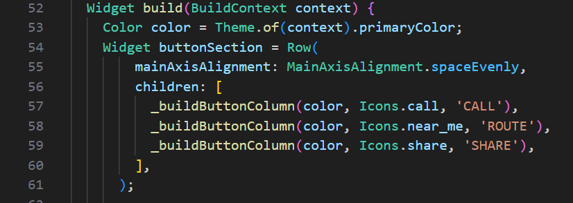

Nama    : Masyithah Sophia Damayanti        
Kelas   : TI-3C / 15        
NIM     : 2241720011

# Pertemuan 7 - Layout dan Navigasi     

## PRAKTIKUM 1: Membangun Layout di Flutter     
### Langkah 1: Buat Project Baru        
     

### Langkah 2: Buka file lib/main.dart      
      

### Langkah 4: Implementasi title row           
    

## Soal 1       
       
**Jawab:** 'crossAxisAlignment: CrossAxisAlignment.start' pada widget Column digunakan untuk menyusun anak widget agar sejajar ke sisi kiri (awal) dari sumbu horizontal di dalam tata letak kolom.
## Soal 2       
  
**Jawab:**  Menampilkan teks "Wisata Gunung di Batu" dengan huruf tebal dan "Batu, Malang, Indonesia" dengan warna abu-abu, menggunakan padding bawah 8.0 pada container.
## Soal 3       
       
**Jawab:** untuk menampilkan icon star/bintang berwarna merah dan teks "41" dalam sebuah baris, dengan padding 32.0 unit di semua sisi.
## Hasil Praktikum 1
     
**Kode Program:**  
```dart 
import 'package:flutter/material.dart';
void main() => runApp(MyApp());

class MyApp extends StatelessWidget {
  //Praktikum 1
  Widget titleSection = Container(
    padding: const EdgeInsets.all(32.0),
    child: Row(
      children: [
        Expanded(
          child: Column(
            crossAxisAlignment: CrossAxisAlignment.start, // Jawaban soal 1
            children: [
              Container(
                padding: const EdgeInsets.only(bottom: 8.0), // Jawaban soal 2
                child: const Text(
                  'Wisata Gunung di Batu',
                  style: TextStyle(
                    fontWeight: FontWeight.bold,
                  ),
                ),
              ),
              Text(
                'Batu, Malang, Indonesia',
                style: TextStyle(
                  color: Colors.grey, // Warna abu-abu
                ),
              ),
            ],
          ),
        ),
        Container(
          padding: const EdgeInsets.all(32.0), // Jawaban soal 3
          child: Row(
            children: [
              Icon(
                Icons.star, // Ikon bintang
                color: Colors.red, // Warna merah
              ),
              const Text('41'), // Teks "41"
            ],
          ),
        ),
      ],
    ),
  );

  @override
  Widget build(BuildContext context) {
    return MaterialApp(
      title: 'Flutter Demo: Masyithah Sophia Damayanti/2241720011',
      home: Scaffold(
        appBar: AppBar(
          title: const Text('My App'),
        ),
        body: Column(
          children: [
            titleSection, // Menampilkan section yang telah dibuat
            // Tambahkan widget lain di sini jika diperlukan
          ],
        ),
      ),
    );
  }  
```  
## PRAKTIKUM 2: Implementasi button row     
### Langkah 1: Buat method Column _buildButtonColumn    


### Langkah 2: Buat widget buttonSection        
      

### Langkah 3: Tambah button section ke body 
         

## Hasil Praktikum 2        
     
**Kode Program:**
```dart
import 'package:flutter/material.dart';
void main() => runApp(MyApp());

class MyApp extends StatelessWidget {
  //Praktikum 1
  Widget titleSection = Container(
    padding: const EdgeInsets.all(32.0),
    /* soal 1*/
    child: Row(
      children: [
        Expanded(
          child: Column(
            crossAxisAlignment: CrossAxisAlignment.start, // Jawaban soal 1
            children: [
              /* soal 2*/
              Container(
                padding: const EdgeInsets.only(bottom: 8.0), // Jawaban soal 2
                child: const Text(
                  'Wisata Gunung di Batu',
                  style: TextStyle(
                    fontWeight: FontWeight.bold,
                  ),
                ),
              ),
              Text(
                'Batu, Malang, Indonesia',
                style: TextStyle(
                  color: Colors.grey, // Warna abu-abu
                ),
              ),
            ],
          ),
        ),
        Container(
          padding: const EdgeInsets.all(32.0), // Jawaban soal 3
          child: Row(
            children: [
              /* soal 3*/
              Icon(
                Icons.star, // Ikon bintang
                color: Colors.red, // Warna merah
              ),
              const Text('41'), // Teks "41"
            ],
          ),
        ),
      ],
    ),
  );

  @override
  Widget build(BuildContext context) {
    //Praktikum 2 Langkah 2
    Color color = Theme.of(context).primaryColor;
    Widget buttonSection = Row(
        mainAxisAlignment: MainAxisAlignment.spaceEvenly,
        children: [
          _buildButtonColumn(color, Icons.call, 'CALL'),
          _buildButtonColumn(color, Icons.near_me, 'ROUTE'),
          _buildButtonColumn(color, Icons.share, 'SHARE'),
        ],
      );

    return MaterialApp(
      title: 'Flutter Demo: Masyithah Sophia Damayanti/2241720011',
      home: Scaffold(
        appBar: AppBar(
          title: const Text('My App'),
        ),
        body: Column(
          children: [
            titleSection, // Menampilkan section yang telah dibuat
            buttonSection,// Praktikum 2 Langkah 3
          ],
        ),
      ),
    );
  }
  //Praktikum 2 Langkah 1
  Column _buildButtonColumn(Color color, IconData icon, String label) {
    return Column(
      mainAxisSize: MainAxisSize.min,
      mainAxisAlignment: MainAxisAlignment.center,
      children: [
        Icon(icon, color: color),
        Container(
          margin: const EdgeInsets.only(top: 8),
          child: Text(
            label,
            style: TextStyle(
              fontSize: 12,
              fontWeight: FontWeight.w400,
              color: color,
            ),
          ),
        ),
      ],
    );
  }
}
```   

## PRAKTIKUM 3: Implementasi Text Section       
### Langkah 1: Buat widget textSection      


### Langkah 2: Tambahkan variabel text section ke body          
 
## Hasil Praktikum 3        


## PRAKTIKUM 4: Implementasi image section      
### Langkah 1: Siapkan aset gambar      

### Langkah 2: Tambahkan gambar ke body     

### Langkah 3: Terakhir, ubah menjadi ListView      
   

## Hasil Praktikum 4

**Kode Program:** 
```dart 
import 'package:flutter/material.dart';
void main() => runApp(MyApp());

class MyApp extends StatelessWidget {
  //Praktikum 1
  Widget titleSection = Container(
    padding: const EdgeInsets.all(32.0),
    /* soal 1*/
    child: Row(
      children: [
        Expanded(
          child: Column(
            crossAxisAlignment: CrossAxisAlignment.start, // Jawaban soal 1
            children: [
              /* soal 2*/
              Container(
                padding: const EdgeInsets.only(bottom: 8.0), // Jawaban soal 2
                child: const Text(
                  'Wisata Gunung di Batu',
                  style: TextStyle(
                    fontWeight: FontWeight.bold,
                  ),
                ),
              ),
              Text(
                'Batu, Malang, Indonesia',
                style: TextStyle(
                  color: Colors.grey, // Warna abu-abu
                ),
              ),
            ],
          ),
        ),
        Container(
          padding: const EdgeInsets.all(32.0), // Jawaban soal 3
          child: Row(
            children: [
              /* soal 3*/
              Icon(
                Icons.star, // Ikon bintang
                color: Colors.red, // Warna merah
              ),
              const Text('41'), // Teks "41"
            ],
          ),
        ),
      ],
    ),
  );

  @override
  Widget build(BuildContext context) {
    //Praktikum 2 Langkah 2
    Color color = Theme.of(context).primaryColor;
    Widget buttonSection = Row(
        mainAxisAlignment: MainAxisAlignment.spaceEvenly,
        children: [
          _buildButtonColumn(color, Icons.call, 'CALL'),
          _buildButtonColumn(color, Icons.near_me, 'ROUTE'),
          _buildButtonColumn(color, Icons.share, 'SHARE'),
        ],
      );
      //Praktikum 3 langkah 1
    Widget textSection = Container(
      padding: const EdgeInsets.all(32),
      child: const Text(
        'Coban Talun Daya Tarik Coban Talun Coban yang berarti air terjun ini memiliki ketinggian 50 sampai 60 meter dengan aliran air yang jernih.' 
        'Air Coban talun berasal dari aliran Sungai Brantas yang masuk ke dalam hutan lindung dan memiliki aliran  yang deras. (Masyithah 2241720011)',
        softWrap: true,
      ),
    );

    return MaterialApp(
      title: 'Flutter Demo: Masyithah Sophia Damayanti/2241720011',
      home: Scaffold(
        appBar: AppBar(
          title: const Text('Flutter layout demo'),
        ),
        body: ListView( 
          //Praktikum 4 Langkah 2
          children: [
            Image.asset(
              'images/coban talun.jpg',
              width: 600,
              height: 240,
              fit: BoxFit.cover,
            ),
            titleSection, // Menampilkan section yang telah dibuat
            buttonSection,// Praktikum 2 Langkah 3
            textSection,//Praktikum 3 Langkah 2
          ],
        ),
      ),
    );
  }
  //Praktikum 2 Langkah 1
  Column _buildButtonColumn(Color color, IconData icon, String label) {
    return Column(
      mainAxisSize: MainAxisSize.min,
      mainAxisAlignment: MainAxisAlignment.center,
      children: [
        Icon(icon, color: color),
        Container(
          margin: const EdgeInsets.only(top: 8),
          child: Text(
            label,
            style: TextStyle(
              fontSize: 12,
              fontWeight: FontWeight.w400,
              color: color,
            ),
          ),
        ),
      ],
    );
  }
}
```
