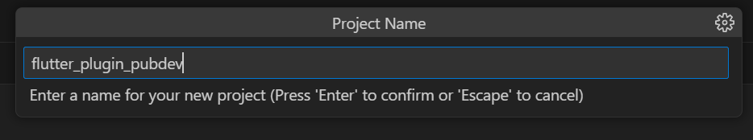

Nama    : Masyithah Sophia Damayanti      
Kelas   : TI - 3C / 15      
NIM     : 2241720011        
No      : 15        

# Pertemuan 7 Manajemen Plugin        
## Praktikum 1 - Menerapkan Plugin di Project Flutter       

### Langkah 1: Buat Project Baru   
        
### Langkah 2: Menambahkan Plugin       
        
### Langkah 3: Buat file red_text_widget.dart       
        
Kode Program:       
``` dart        
import 'package:flutter/material.dart';

class RedTextWidget extends StatelessWidget {
  const RedTextWidget({Key? key}) : super(key: key);

  @override
  Widget build(BuildContext context) {
    return Container();
  }
}       
```         
Jawab: Karena variabel text belum didefinisikan di dalam class RedTextWidget       
### Langkah 4: Tambah Widget AutoSizeText   

Kode Program:       
``` dart        
import 'package:flutter/material.dart';
import 'package:auto_size_text/auto_size_text.dart';

class RedTextWidget extends StatelessWidget {
  const RedTextWidget({Key? key}) : super(key: key);

  @override
  Widget build(BuildContext context) {
    return AutoSizeText(
      text,
      style: const TextStyle(color: Colors.red, fontSize: 14),
      maxLines: 2,
      overflow: TextOverflow.ellipsis,
    );
  }
}
```                 
### Langkah 5: Buat Variabel text dan parameter di constructor          
        
Kode Program:       
``` dart     
import 'package:flutter/material.dart';
import 'package:auto_size_text/auto_size_text.dart';

class RedTextWidget extends StatelessWidget {
  final String text;
  const RedTextWidget({Key? key, required this.text}) : super(key: key);

  @override
  Widget build(BuildContext context) {
    return AutoSizeText(
      text,
      style: const TextStyle(color: Colors.red, fontSize: 14),
      maxLines: 2,
      overflow: TextOverflow.ellipsis,
    );
  }
}           
```     
### Langkah 6: Tambahkan widget di main.dart        
  
Kode program:       
```dart     
import 'package:flutter/material.dart';
import 'package:flutter_plugin_pubdev/red_text_widget.dart';

void main() {
  runApp(const MyApp());
}

class MyApp extends StatelessWidget {
  const MyApp({super.key});
  // This widget is the root of your application.
  @override
  Widget build(BuildContext context) {
    return MaterialApp(
      title: 'Flutter Demo',
      theme: ThemeData(
        colorScheme: ColorScheme.fromSeed(seedColor: Colors.deepPurple),
        useMaterial3: true,
      ),
      home: const MyHomePage(title: 'Flutter Demo Home Page'),
    );
  }
}

class MyHomePage extends StatefulWidget {
  const MyHomePage({super.key, required this.title});

  final String title;

  @override
  State<MyHomePage> createState() => _MyHomePageState();
}

class _MyHomePageState extends State<MyHomePage> {
  int _counter = 0;

  void _incrementCounter() {
    setState(() {
      _counter++;
    });
  }

  @override
  Widget build(BuildContext context) {
    return Scaffold(
      appBar: AppBar(
        backgroundColor: Theme.of(context).colorScheme.inversePrimary,
        title: Text(widget.title),
      ),
       body: Center(
        child: Column(
          mainAxisAlignment: MainAxisAlignment.center,
          children: <Widget>[
            Container(
              color: Colors.yellowAccent,
              width: 50,
              child: const RedTextWidget(
                text: 'You have pushed the button this many times:',
              ),
            ),
            Container(
              color: Colors.greenAccent,
              width: 100,
              child: const Text(
                'You have pushed the button this many times:',
              ),
            ),
          ],
        ),
      ),
      floatingActionButton: FloatingActionButton(
        onPressed: _incrementCounter,
        tooltip: 'Increment',
        child: const Icon(Icons.add),
      ),
    );
  }
}
``` 
## Hasil:       
     

## Tugas Praktikum      

### 1 - Selesaikan Praktikum tersebut, lalu dokumentasikan dan push ke repository Anda berupa screenshot hasil pekerjaan beserta penjelasannya di file README.md!       

### 2 - Jelaskan maksud dari langkah 2 pada praktikum tersebut!      
Jawab: Kode tersebut untuk menambahkan plugin auto_size_text ke dalam proyek Flutter yang telah dibuat. Secara spesifik, langkah ini bertujuan untuk memungkinkan aplikasi Flutter menyesuaikan ukuran teks secara otomatis agar sesuai dengan ruang yang tersedia, menggunakan plugin auto_size_text.      
## 3 - Jelaskan maksud dari langkah 5 pada praktikum tersebut!            
Jawab: Variabel final String text mendefinisikan bahwa widget RedTextWidget akan menerima sebuah nilai teks (String). Dengan menambahkan variabel text dan parameter di constructor, widget RedTextWidget sekarang bisa menampilkan teks yang dapat disesuaikan berdasarkan kebutuhan. Hal ini membuat widget lebih fleksibel dan reusable dalam berbagai konteks tanpa perlu mendefinisikan ulang widget untuk setiap teks yang berbeda.       
## 4 - Pada langkah 6 terdapat dua widget yang ditambahkan, jelaskan fungsi dan perbedaannya!    
Jawab:      
Perbedaan:          
>- RedTextWidget memberikan kontrol lebih pada gaya teks yang konsisten (dalam hal ini warna merah), 
>- sementara Text adalah widget standar yang menampilkan teks tanpa pengaturan gaya kecuali ditentukan secara manual.       

Fungsi:        
>-Kedua Container berfungsi sebagai pembungkus untuk teks, tetapi memiliki perbedaan dalam ukuran dan warna latar belakang.       
## 5 - Jelaskan maksud dari tiap parameter yang ada di dalam plugin auto_size_text berdasarkan tautan pada dokumentasi ini !       
Jawab: 
>- text     
 Ini adalah teks yang akan ditampilkan oleh widget AutoSizeText. Di dalam kode, teks ini diteruskan dari konstruktor widget RedTextWidget. Teks yang diteruskan wajib diisi dan akan otomatis menyesuaikan ukurannya sesuai ruang yang tersedia.
>- style        
 Mengatur gaya dari teks yang ditampilkan, seperti warna, ukuran font, ketebalan, dll. Pada kode ini, gaya teks diatur dengan warna merah (Colors.red) dan ukuran font 14. Jika tidak ditentukan, gaya default yang digunakan.
>- maxLines     
 Menentukan jumlah maksimal baris yang bisa digunakan untuk menampilkan teks. Di dalam kode, maxLines: 2 berarti teks akan ditampilkan dalam maksimal dua baris. Jika teks terlalu panjang, maka sisanya akan dipotong sesuai pengaturan overflow.
>- overflow         
 Menentukan bagaimana teks yang melebihi ruang yang tersedia harus ditampilkan. Pada kode ini, TextOverflow.ellipsis berarti teks yang melebihi batas akan dipotong dan digantikan dengan tanda elipsis (...). Nilai lainnya yang bisa digunakan adalah TextOverflow.clip (memotong teks tanpa tanda elipsis) atau TextOverflow.fade (membuat teks yang meluap memudar).        

## 6 - Kumpulkan laporan praktikum Anda berupa link repository GitHub kepada dosen!     


